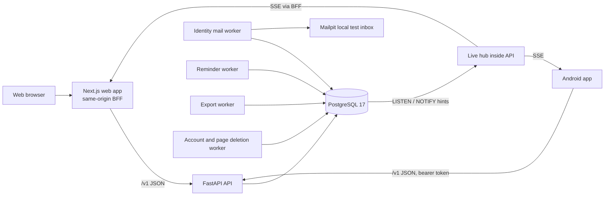

# Architecture

How the system is built today, and where the intended design is written. As-built descriptions refreshed on 2026-10-03 for the [blueprint audit](BLUEPRINT_AUDIT_2026-10-03.md); source, running services and historical test results are separate evidence. Labels follow the [Product Understanding](PRODUCT_UNDERSTANDING.md#labels).

This is level 4 of the [authority hierarchy](PRODUCT_CONSTITUTION.md#article-4-authority-hierarchy). Only the CONFIRMED rules below bind. Everything else here describes the current implementation, which is evidence, not the intended architecture ([Constitution Article 6](PRODUCT_CONSTITUTION.md#article-6-code-and-tests-are-evidence)). The intended design is PROPOSED in the Chapter 10 contract and the ADRs until confirmed.

## Rules

- **CONFIRMED** Build on the existing stack; do not switch to a different one (R13).
- **CONFIRMED** Workflows are deterministic, and AI assists but is never the source of truth (R9). Timers, retries, state changes and permissions never depend on a model.
- **PROPOSED** One modular backend with separate workers; split into services only when a measured need appears ([Chapter 10 contract](CHAPTER_10_BACKEND_OPERATIONS_CONTRACT.md)). Built this way.
- **PROPOSED** Architecture changes are written as ADRs in [adr/](adr/) and listed in [DECISIONS.md](DECISIONS.md).

## System Overview

## Components

| Component | Technology | Location | Status |
| --- | --- | --- | --- |
| Web app | Next.js 16, React 19, TypeScript, TanStack Query, Zod | `web/` | Built |
| Web BFF | Same-origin proxy: allowlist of API routes, Origin checks, HttpOnly session cookie | `web/src/app/api/[...path]/route.ts` | Built |
| Android app | Kotlin, Jetpack Compose, Hilt, Retrofit and OkHttp, Keystore session storage; Room and WorkManager for unsent chat | `android/` | Built; durable offline writes are limited to chat ([DEC-021](DECISIONS.md#accepted-decisions)) |
| Design tokens | One JSON file; `scripts/design-tokens.mjs` generates web CSS variables (`web/src/app/design-tokens.css`) and Android constants (`DesignTokens.kt`), and checks them | `packages/design-tokens/` | Built and adopted by selected web and Android screens; the generator's guarded file lists and T37 track coverage, not a claim that every screen is compliant ([DEC-013](DECISIONS.md#accepted-decisions)) |
| API | Python FastAPI modular monolith, SQLAlchemy 2, Alembic migrations | `backend/app/` | Built |
| Database | PostgreSQL 17 | Compose service `db` | Built |
| Identity mail worker | Sends sign-in codes to the local test inbox | `backend/app/worker.py`, Compose service `identity-mail-worker` | Built |
| Reminder worker | Delivers due reminders to the in-app inbox; for a repeating reminder, schedules its next time in the same transaction | `backend/app/reminder_worker.py`, Compose service `reminder-worker` | Built |
| Export worker | Prepares account exports | [export_worker.py](../backend/app/export_worker.py), Compose service `export-worker` | Built locally (T68) |
| Deletion worker | Erases due accounts and deleted pages in bounded batches | [deletion_worker.py](../backend/app/deletion_worker.py), Compose service `account-deletion-worker` | Built locally (T68, T85); retention and production policy remain separate gates |
| Local mail | Mailpit | Compose service `mail` | Built; local only |
| Agent runtime | Rule-based parser and synchronous domain-service calls, with stored runs, questions, approvals, tool outcomes and memories | [service.py](../backend/app/modules/agents/service.py), [tools.py](../backend/app/modules/agents/tools.py) | Connected on backend, web and Android (T33-T35); seven tools, four approval-required mutations. No model, LangGraph runtime or independently configurable agent bindings; memories remain account-scoped (C13) |
| Live updates | PostgreSQL LISTEN/NOTIFY and server-sent events (SSE) | [hub.py](../backend/app/modules/realtime/hub.py), [service.py](../backend/app/modules/realtime/service.py) | Built (T65, T124); hints trigger authorized API reads. Not a durable event log or WebSocket service |

Local services start from `infra/compose.yaml`. The web preview runs only at http://127.0.0.1:3000.

## Backend Modules

Implemented domains generally use `api.py` (routes), `schemas.py` (request and response shapes), `service.py` (rules and transactions) and `models.py` (tables). Realtime has no durable tables, and some reserved modules have no implementation. The modules, their tables and their client folders are listed in [DOMAIN.md](DOMAIN.md#modules-and-tables).

## Cross-Cutting Patterns

| Pattern | As built |
| --- | --- |
| API shape | Routes under `/v1`. Success returns `{data, request_id, pagination}`; errors return `{error: {code, message, details}, request_id}`. This follows ADR-0001 and ADR-0002, which are still PROPOSED. |
| API artifact verification | `npm run check:openapi` compares the stored artifact with source OpenAPI in a cached, network-disabled container with read-only mounts; the default `contracts` suite runs its regression tests and comparison (T166). Regeneration remains explicit, with no application key-file or database access. Web Zod and Android Retrofit DTOs remain handwritten and need their own compatibility tests. |
| Retries | Retryable commands use actor- and operation-scoped `Idempotency-Key` receipts. An exact retry does not repeat the change; some receipts return the currently authorized state, not a frozen first response. Headers and replay rules are operation-specific. |
| Review before change | Edits carry `If-Match` with the version the person reviewed; stale edits are refused. |
| Access | The backend takes the account from the session and checks the current admission and access to the item on every request. History boundaries compare admission order numbers within the Space, not timestamps. |
| Audit and outbox | Many domain changes commit with their audit and outbox records. Generic outbox publication/consumption is not implemented (T139), and some public interactions still lack audit/outbox coverage (G8). Durable reminder, mail and export work uses its own stored records; live hints use transactional `pg_notify`, not an outbox consumer. |
| Encryption at rest | Emails, message bodies, care details, exports and some lookup values are protected with keys derived from one local key file, `backend/.local/identity.key`. The file can hold several keys: new values use the primary one and older values still open with the others. Rotation is staged and needs restarts: add a key, make it primary, re-encrypt stored values, verify, then retire the old key after 24 hours ([procedure](../backend/app/modules/platform/README.md#encryption-key-rotation)). The lookup key is never rotated. |
| Sessions | Opaque tokens, stored as digests. The web keeps the token in an HttpOnly, SameSite=Strict cookie; Android keeps it in Keystore-protected storage. Messaging, community and event changes check the session again just before commit, because a lock wait can outlast it. |
| Native request coordination | Authenticated feature requests capture credentials under a mutex, then release it before network work. A 401, logout, sign-in-again or acknowledged deletion clears only the captured session if it is still current. Required cleanup survives cancellation; storage errors remain visible. Credential-producing transitions and startup profile restoration retain their existing serialization. Screen-level read/command ordering guards remain mandatory ([T82 evidence](BUILD_STATUS.md#android-authenticated-request-concurrency)). |
| Client retries | Web changes are memory-only; chat keeps unconfirmed sends across conversations during the page session. Android chat additionally seals unsent messages with Keystore AES-GCM, stores them in Room and retries through WorkManager with the original key (T67). Other Android command retries are not a general durable offline queue. |
| Live updates | `/v1/live` sends identifier-only SSE hints after database commit. The clients re-read through authorized APIs and chat uses slower polling while connected. Reconnection/overflow asks for resynchronization; missed hints are not durably replayed. The five-stream-per-account limit is local to each API process; remaining invalidation/fallback gaps are T106. |
| Documents and search | Text documents are stored in PostgreSQL, split into passages with line numbers, and indexed by a generated full-text column (`simple` configuration, GIN index); there is no object storage or vector index yet. Search inside your Spaces runs one query per kind (documents, tasks, events) with the person's membership, history rule and task grants joined inside it ([files](../backend/app/modules/files/README.md), [discovery](../backend/app/modules/discovery/README.md); [DEC-015](DECISIONS.md#accepted-decisions)). Request bodies are limited to 16 KB, except adding a document (2.2 MB) and writing a post (64 KB), on the API and the web proxy alike. |
| Telemetry | The API writes one JSON line per request: request and W3C trace IDs, method, route template, status, duration and error code, never paths, queries, headers, bodies or account data (`backend/app/telemetry.py`). The web proxy starts each trace and writes a matching line. `/metrics` gives request counts and durations by route template in the Prometheus text format, only with the `COMMUNITY_METRICS_KEY` bearer key. Database-backed work gauges cover mail, reminders, exports and account/page deletion readiness and age; account ownership blocks are separate. Persisted failure counts exist only for mail/reminders/exports, not purges (T32/T167; [metric meanings](../backend/app/modules/platform/README.md#background-work-gauges)). Workers write one JSON line per cycle with counts only. |

## Not Built Yet

- **PROPOSED** Redis for temporary data, object storage for files and a vector index (Chapter 6, 10 and 14 contracts). Text documents and their full-text index live in PostgreSQL today. WebSocket is not the current live transport: SSE is the local choice in [ADR-0006](adr/0006-live-updates.md) and DEC-019.
- **PROPOSED** A generic outbox reader for durable downstream consumers (T139). Existing live hints and stored reminder work must not be mistaken for that reader.
- **CONFIRMED** requirement, partly built: request logs, trace IDs and metrics exist (T09), and so do background work metrics (T32/T167), including account/page purge backlogs and ownership blocks. Not built: a log and metrics collector, dashboards, alerts (their targets wait for Q19), database metrics, durable purge failure history, and traces that continue into workers (R12).
- **PROPOSED** Continuous integration, staging and production environments, a secrets manager, and backups with agreed recovery targets (Chapter 10 contract). Only a local restore drill exists.
- **TBD** Cloud provider, regions and queue technology.

## Where the Intended Design Lives

| Topic | Document |
| --- | --- |
| Backend processes, deployment and operations | [Chapter 10 contract](CHAPTER_10_BACKEND_OPERATIONS_CONTRACT.md) |
| API, events and realtime | [Chapter 7 contract](CHAPTER_07_API_REALTIME_CONTRACT.md) |
| Data model | [Chapter 6 contract](CHAPTER_06_DATA_CONTRACT.md) |
| Android | [Chapter 8 contract](CHAPTER_08_ANDROID_CONTRACT.md) |
| Web | [Chapter 9 contract](CHAPTER_09_WEB_CONTRACT.md) |
| Agent runtime | [Chapter 12 contract](CHAPTER_12_AGENT_RUNTIME_CONTRACT.md) |
| Files and retrieval | [Chapter 14 contract](CHAPTER_14_FILE_DOCUMENT_RAG_CONTRACT.md) |
| Architecture decisions | [ADRs](adr/) and [DECISIONS.md](DECISIONS.md) |

Known architecture risks and their fixes are tracked in [TASKS.md](TASKS.md).
