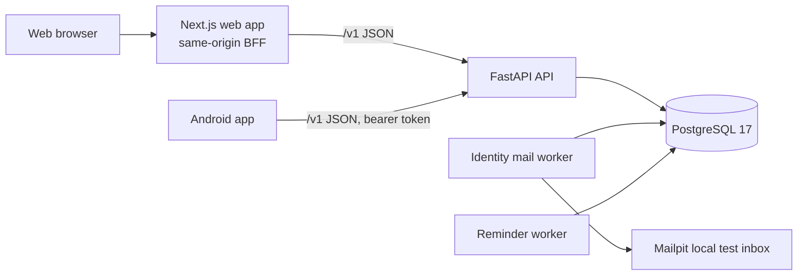

# Architecture

How the system is built today, and where the intended design is written. As built at migration 0022 on 2026-10-01. Labels follow the [Product Understanding](PRODUCT_UNDERSTANDING.md#labels).

This is level 4 of the [authority hierarchy](PRODUCT_CONSTITUTION.md#article-4-authority-hierarchy). Only the CONFIRMED rules below bind. Everything else here describes the current implementation, which is evidence, not the intended architecture ([Constitution Article 6](PRODUCT_CONSTITUTION.md#article-6-code-and-tests-are-evidence)). The intended design is PROPOSED in the Chapter 10 contract and the ADRs until confirmed.

## Rules

- **CONFIRMED** Build on the existing stack; do not switch to a different one (R13).
- **CONFIRMED** Workflows are deterministic, and AI assists but is never the source of truth (R9). Timers, retries, state changes and permissions never depend on a model.
- **PROPOSED** One modular backend with separate workers; split into services only when a measured need appears ([Chapter 10 contract](CHAPTER_10_BACKEND_OPERATIONS_CONTRACT.md)). Built this way.
- **PROPOSED** Architecture changes are written as ADRs in [adr/](adr/) and listed in [DECISIONS.md](DECISIONS.md).

## System Overview

## Components

| Component | Technology | Location | Status |
| --- | --- | --- | --- |
| Web app | Next.js 16, React 19, TypeScript, TanStack Query, Zod | `web/` | Built |
| Web BFF | Same-origin proxy: allowlist of API routes, Origin checks, HttpOnly session cookie | `web/src/app/api/[...path]/route.ts` | Built |
| Android app | Kotlin, Jetpack Compose, Hilt, Retrofit and OkHttp, Keystore session storage | `android/` | Built |
| Design tokens | One JSON file; `scripts/design-tokens.mjs` generates web CSS variables (`web/src/app/design-tokens.css`) and Android constants (`DesignTokens.kt`), and checks them | `packages/design-tokens/` | Built for the global stylesheet and the Android theme; feature styles still hold their own values ([DEC-013](DECISIONS.md#accepted-decisions), provisional) |
| API | Python FastAPI modular monolith, SQLAlchemy 2, Alembic migrations | `backend/app/` | Built |
| Database | PostgreSQL 17 | Compose service `db` | Built |
| Identity mail worker | Sends sign-in codes to the local test inbox | `backend/app/worker.py`, Compose service `identity-mail-worker` | Built |
| Reminder worker | Delivers due reminders to the in-app inbox; for a repeating reminder, schedules its next time in the same transaction | `backend/app/reminder_worker.py`, Compose service `reminder-worker` | Built |
| Export worker | Prepares account exports | `backend/app/export_worker.py` | Code only; not in Compose |
| Local mail | Mailpit | Compose service `mail` | Built; local only |
| Agent runtime | LangGraph (planned) | `agent/`, `backend/app/modules/agents/` | Not built: an unconnected parser, models and tool definitions |

Local services start from `infra/compose.yaml`. The web preview runs only at http://127.0.0.1:3000.

## Backend Modules

Each module in `backend/app/modules/` owns its tables and uses the same layout: `api.py` (routes), `schemas.py` (request and response shapes), `service.py` (rules and transactions) and `models.py` (tables). The modules, their tables and their client folders are listed in [DOMAIN.md](DOMAIN.md#modules-and-tables).

## Cross-Cutting Patterns

| Pattern | As built |
| --- | --- |
| API shape | Routes under `/v1`. Success returns `{data, request_id, pagination}`; errors return `{error: {code, message, details}, request_id}`. This follows ADR-0001 and ADR-0002, which are still PROPOSED. |
| Retries | Changes carry an `Idempotency-Key`. A retry with the same key and body returns the first result. |
| Review before change | Edits carry `If-Match` with the version the person reviewed; stale edits are refused. |
| Access | The backend takes the account from the session and checks the current admission and access to the item on every request. History boundaries compare admission order numbers within the Space, not timestamps. |
| Audit and outbox | A change, its audit event and an outbox record commit in one transaction. Nothing reads the outbox yet. |
| Encryption at rest | Emails, message bodies, care details, exports and some lookup values are protected with keys derived from one local key file, `backend/.local/identity.key`. The file can hold several keys: new values use the primary one and older values still open with the others. Rotation is staged and needs restarts: add a key, make it primary, re-encrypt stored values, verify, then retire the old key after 24 hours ([procedure](../backend/app/modules/platform/README.md#encryption-key-rotation)). The lookup key is never rotated. |
| Sessions | Opaque tokens, stored as digests. The web keeps the token in an HttpOnly, SameSite=Strict cookie; Android keeps it in Keystore-protected storage. Messaging, community and event changes check the session again just before commit, because a lock wait can outlast it. |
| Client retries | Web and Android keep an unconfirmed change's retry key in memory only; closing or reloading the app loses it. Web chat keeps unconfirmed sends for the whole signed-in page session, across conversations. |
| Live updates | None. Open chat screens poll every 5 seconds. |
| Telemetry | The API writes one JSON line per request: request and W3C trace IDs, method, route template, status, duration and error code, never paths, queries, headers, bodies or account data (`backend/app/telemetry.py`). The web proxy starts each trace and writes a matching line. `/metrics` gives request counts and durations by route template in the Prometheus text format, only with the `COMMUNITY_METRICS_KEY` bearer key. It also shows, for sign-in mail, reminders and exports, how many items the worker could take now, how long the oldest has waited and how many ended in failure, read from the database at each scrape (`backend/app/modules/platform/work.py`). Workers write one JSON line per cycle with counts only. |

## Not Built Yet

- **PROPOSED** Redis for temporary data, object storage for files, a search index and live updates over WebSocket (Chapter 6, 7, 10 and 14 contracts).
- **PROPOSED** An outbox reader for notifications, live updates and moderation work.
- **CONFIRMED** requirement, partly built: request logs, trace IDs and metrics exist (T09). Not built: a log and metrics collector, dashboards, alerts (their targets wait for Q19), worker and database metrics, and traces that continue into workers (R12).
- **PROPOSED** Continuous integration, staging and production environments, a secrets manager, and backups with agreed recovery targets (Chapter 10 contract). Only a local restore drill exists.
- **TBD** Cloud provider, regions and queue technology.

## Where the Intended Design Lives

| Topic | Document |
| --- | --- |
| Backend processes, deployment and operations | [Chapter 10 contract](CHAPTER_10_BACKEND_OPERATIONS_CONTRACT.md) |
| API, events and realtime | [Chapter 7 contract](CHAPTER_07_API_REALTIME_CONTRACT.md) |
| Data model | [Chapter 6 contract](CHAPTER_06_DATA_CONTRACT.md) |
| Android | [Chapter 8 contract](CHAPTER_08_ANDROID_CONTRACT.md) |
| Web | [Chapter 9 contract](CHAPTER_09_WEB_CONTRACT.md) |
| Agent runtime | [Chapter 12 contract](CHAPTER_12_AGENT_RUNTIME_CONTRACT.md) |
| Files and retrieval | [Chapter 14 contract](CHAPTER_14_FILE_DOCUMENT_RAG_CONTRACT.md) |
| Architecture decisions | [ADRs](adr/) and [DECISIONS.md](DECISIONS.md) |

Known architecture risks and their fixes are tracked in [TASKS.md](TASKS.md).
