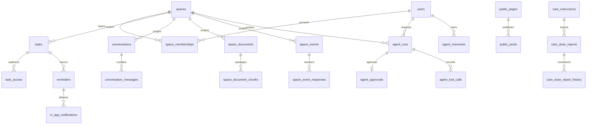

# Engineering Blueprint Audit

Date: 2026-10-03. Source: Part D, the owner's [Complete System Architecture and Engineering Blueprint](%23%20Complete%20System%20Architecture%20and%20Engin.md).

This is repository evidence, not a replacement architecture or a production approval. The [Constitution](PRODUCT_CONSTITUTION.md), confirmed decisions and [documentation map](README.md) still govern. The source's repeated checklists, suggested packages, example latency targets and proposed product additions are not approvals or measured completion counts.

## 1. Scope and Evidence

The audit covers the existing backend, data, web, Android, agents, asynchronous work and local operations. Existing [community](COMMUNITY_AUDIT_2026-10-02.md) and [PRD](PRD_AUDIT_2026-10-02.md) audits own the detailed Part B and Part C feature comparisons. Their tasks are reused, not recreated here.

Only local synthetic verification is allowed (DEC-004/005). No external providers, real accounts, spending, deployment, production secrets, shared database resets or app-wide implementation wave are authorized by this audit. Web preview remains http://127.0.0.1:3000.

Status vocabulary:

| Status | Meaning |
| --- | --- |
| Implemented and verified | The named behavior passed the stated check on its recorded source state; not the entire domain or a production claim. |
| Implemented but unverified | Code exists, but the required current runtime evidence is absent. |
| Partially implemented | A usable subset exists; the missing dimensions are named. |
| Missing | No implementation found in the inspected owning surface. This does not authorize adding it. |
| Broken | A stated check failed, or a defect is reproduced; the affected scope and owner are named. |
| Blocked | A decision, permission, dependency or qualification gate prevents the next action. |
| Not applicable | An optional technology or workflow is not necessary for the current approved local scope. |

Source changes by other sessions are preserved. A successful old checkpoint is historical evidence after its implementation changes; a source migration file is not proof the shared API or database has loaded it.

## 2. Verification Ledger

### Initial Local Baseline

Command: `scripts/verify.ps1 -Suite records,structure,tokens,typecheck,client -Output .local/verify/blueprint-20261003-initial`, executed through the VS Code task on 2026-10-03, 01:55:19-01:56:57 +05:30. Source: commit `5c955c4` plus 142 uncommitted changes. Report: [.local/verify/blueprint-20261003-initial/summary.md](../.local/verify/blueprint-20261003-initial/summary.md).

| Check | Actual result | Scope |
| --- | --- | --- |
| Records | 5/5 and preservation check passed | Existing task, decision, checkpoint and changelog records against Git history |
| Structure | 5/5 and source/catalog check passed | 21 original sources and the existing catalog, not all Part D capabilities |
| Design tokens | 10/10 and generated-file check passed | The generator's guarded surfaces, not full accessibility |
| Web types | Failed: 52 TS2345 errors in the agent screen | Missing `agent.*` translation keys; T98 owns the incomplete translation work |
| Web client/BFF | 204/204 passed | Simulated transport/schema/proxy checks, not live browser/backend journeys |

The runner detected three files changed during the run: the new `0037` migration, DECISIONS and TASKS. This is not a frozen, all-green application baseline. The failed typecheck is retained in [typecheck.log](../.local/verify/blueprint-20261003-initial/typecheck.log), not hidden by a scoped success.

The first task launch failed before any suite started because its shell command included the PowerShell call operator in the executable name. Removing that operator from [tasks.json](../.vscode/tasks.json) made the same task execute; no tests were disabled or assertions weakened.

### Frozen Backend Verification

The [local audit runner](../.local/blueprint-audit-run.mjs) copied the backend and stored contract before verification, checked every copied/source SHA-256 and ran against the existing synthetic `community_test` database with the fixture's unique schema. The copied backend was mounted read-only; cached images were required and image pulling was disabled. The shared development database, API, workers and other sessions' containers were not restarted, migrated or reset.

Command: `node .local/blueprint-audit-run.mjs --verify .local/blueprint-audit-2026-10-02T20-43-23-019Z-c752f481`. The exact Docker arguments are in [result.json](../.local/blueprint-audit-2026-10-02T20-43-23-019Z-c752f481/result.json). It executes `pytest -q --tb=short -p no:cacheprovider --junitxml=/evidence/backend.xml` for these eight existing files:

| Test file | Scope |
| --- | --- |
| [test_migrations.py](../backend/tests/test_migrations.py) | Migration/model parity and existing data-preservation checks |
| [test_space_privacy.py](../backend/tests/test_space_privacy.py) | Private Space versus nonexistent Space disclosure boundaries |
| [test_agents.py](../backend/tests/test_agents.py) | Rule-based requests, authority, questions, exact approval, effects and personal memory |
| [test_space_agent_switch.py](../backend/tests/test_space_agent_switch.py) | Turning the agent off and isolation from other Spaces |
| [test_live_updates.py](../backend/tests/test_live_updates.py) | Transactional hints, scoped streaming and real-server closed-stream release |
| [test_work_metrics.py](../backend/tests/test_work_metrics.py) | The three implemented work-gauge queues and failed reads |
| [test_telemetry.py](../backend/tests/test_telemetry.py) | Request telemetry, trace identifiers and privacy |
| [test_restore_drill.py](../backend/tests/test_restore_drill.py) | Restore verifier behavior; not a fresh end-to-end backup drill |

Result: **69 passed, 0 failed, 0 errors, 0 skipped**, pytest elapsed **999.71 s**. Runner including metadata/container startup: **2026-10-03 02:14:10-02:32:43 +05:30**. Exit 0, all copied hashes unchanged afterwards. Reports: [backend.xml](../.local/blueprint-audit-2026-10-02T20-43-23-019Z-c752f481/backend.xml), [backend.log](../.local/blueprint-audit-2026-10-02T20-43-23-019Z-c752f481/backend.log). Compose warned about another session's orphan container; it was not removed.

### Browser and Historical Evidence Limits

Read-only integrated-browser navigation opened the real login page at `http://127.0.0.1:3000/login`, the API readiness page returned `{"status":"ready"}`, and `/api/taxonomy` returned its vocabulary data. No account was created or signed into and no existing application tab was altered. This proves those specific responses at inspection time, not that every source change is loaded or every journey passes.

An attempted combined viewport/status probe captured images but failed because the integrated browser lacks `Storage.getCookies` for its API-request helper. It also recorded a hydration warning involving a capture-time `caret-color` attribute. A follow-up JavaScript probe was declined by the browser tool, so it was not retried by that route. Those captures are **not counted as passed 320 px/200% or clean-console checks**, and the warning is not claimed as a reproduced production defect.

No full backend suite, current full web component/live suite, Android build/JVM/device suite, fresh full restore drill, load/soak test, external integration, model evaluation or production security review was executed in this audit. Older evidence remains in [EVALUATIONS](EVALUATIONS.md) and its original [BUILD_STATUS](BUILD_STATUS.md) checkpoints. In particular the real local restore at migration `0022` was previously tested; it must not be described as absent or as fresh recovery of `0037`. The T162 workstream added its own chat checkpoint after this source copy; its results are not included in this audit's 69 tests.

## 3. Verified Architecture Corrections

The maintained [architecture](ARCHITECTURE.md) described an older build. These are corrections to as-built facts under Constitution Article 5, not changes to confirmed requirements:

| Earlier description | Current implementation evidence | Qualification limit |
| --- | --- | --- |
| Agent parser/models/tools are unconnected | [AgentService.create_run/approve/execute](../backend/app/modules/agents/service.py#L246) records requests, asks questions and invokes task/reminder services after exact approval; [TOOLS](../backend/app/modules/agents/tools.py#L15) has seven entries, four mutating | No model, LangGraph or configurable binding identity. Account-scoped memories remain the open C13 product question. |
| No live updates | [signal/LiveHub](../backend/app/modules/realtime/hub.py#L16) uses transactional PostgreSQL notifications; [LiveService](../backend/app/modules/realtime/service.py#L13) serves SSE and resync hints | No durable event replay; per-account stream counts are process-local; T106 remains open. |
| Export worker is not in Compose | [compose.yaml](../infra/compose.yaml) includes `export-worker` and `account-deletion-worker`; [deletion worker](../backend/app/deletion_worker.py#L26) also calls page purge | Configuration/source existence is not proof that each currently running process has loaded this source. |
| All Android retries are memory-only | T67 added the encrypted Room chat outbox and WorkManager retry | Chat only; no claim of arbitrary offline edits, exact-time alerts or provider push. |
| Every change writes an outbox entry | The generic outbox still has no consumer (T139); live hints and domain-specific durable jobs are separate mechanisms | Existing G8 interaction audit gaps remain. Do not introduce a broker or replace working jobs solely to match the blueprint. |
| Worker metrics listed without identifying the new purge gap | [QUEUES](../backend/app/modules/platform/work.py#L36) covers only mail, reminders and exports | Account/page deletion backlog and age are not covered by these gauges; collectors, alerting and worker trace continuity remain absent. |

## 4. Capability Matrix

The statuses apply to the scope in each row, not every feature mentioned by the source. A named old checkpoint is retained evidence, not a fresh pass. The approved requirements remain R1-R13; additional scope still needs a decision.

| Area | Status | Repository evidence and what exists | Missing, blocked or unqualified |
| --- | --- | --- | --- |
| Repository controls | Implemented and verified for the executed checks | [verify.ps1](../scripts/verify.ps1), [records-check.mjs](../scripts/records-check.mjs), [feature-catalog.mjs](../scripts/feature-catalog.mjs), [design-tokens.mjs](../scripts/design-tokens.mjs); initial baseline in section 2 | No coherent all-green current release baseline; original-source protection does not cover every new blueprint statement. |
| Identity and sessions | Partially implemented | [IdentityService](../backend/app/modules/identity/service.py), [account API](../backend/app/modules/identity/api.py); synthetic email registration, verification, password sign-in/recovery, revocable opaque sessions, recent-auth controls | External identity/delivery providers, MFA/passkeys, account linking/merging and production recovery/abuse qualification are not established. No refresh-token architecture should be inferred from the blueprint's sample endpoint. |
| Spaces and authorization | Partially implemented | [SpaceService](../backend/app/modules/spaces/service.py), [models](../backend/app/modules/spaces/models.py); family, solo, couple and group Spaces, admission history, invitations, joins, owner/admin/member, reviewed ownership transfer, invite policy and agent switch | Public group directory visibility does not publish its private contents. Temporary/workspace types, broader role/grant policy and whole-Space lifecycle need decisions (D1/D2, T13, T156, T160, T161). |
| Public content and discovery | Partially implemented | [community service](../backend/app/modules/community/service.py), [lifecycle](../backend/app/modules/community/lifecycle.py), [taxonomy](../backend/app/modules/community/taxonomy.py); Pages, posts, comments, likes, follows, saves, pins, moderators, transfer and deletion; classification/interests work T126/T127 | The [community audit](COMMUNITY_AUDIT_2026-10-02.md) owns T126-T151. No automatic public membership/posting policy, verification badge, analytics, news or advertising approval follows. |
| Messaging | Partially implemented | [messaging service](../backend/app/modules/messaging/service.py), [web screen](../web/src/features/messaging/messages-screen.tsx), [Android outbox](../android/app/src/main/java/com/community/platform/feature/messaging/Outbox.kt); scoped text conversations, history, idempotent sends, read state, server-readable ciphertext, SSE hints | Replies/reactions/edits were being changed under T162 during the audit. Attachments, typing/presence, independent device identities and E2EE are not verified; T71 remains blocked. |
| Tasks and checklists | Partially implemented | [planning service](../backend/app/modules/planning/service.py), [task screen](../web/src/features/planning/task-screen.tsx); creation, assignment, status, checklists, reviewed edits and new priority/filters (T153) | No general task dependencies, multiple-assignee policy, recurrence or durable offline edits. T156 would change departure behavior and needs a decision. |
| Calendar and events | Partially implemented | [event service](../backend/app/modules/events/service.py), [calendar screen](../web/src/features/planning/calendar-screen.tsx); local scheduling, RSVP, cancellation, capacity/waitlist (T154), month/week/day and source display choices (T163) | Latest changes lack complete live/native qualification. All-day/recurring events, public events and external calendars remain separate scope. Event alerts and calendar export still belong to C10/X2. |
| Care | Partially implemented | [care service](../backend/app/modules/care/service.py), [care models](../backend/app/modules/care/models.py); private user-entered instructions and Taken/Skipped reports, with correction history (T155) | This is self-reporting, not ingestion proof or clinical advice. Dose notifications, chosen-field sharing, Snoozed/Not now and escalation are not silently added; Q12/Q35, T157/T158 and C10 remain gates. |
| Agent execution | Partially implemented | [AgentService](../backend/app/modules/agents/service.py), [models](../backend/app/modules/agents/models.py); rule-based requests, questions, reviewed approvals, tool results and per-Space enable/disable | No separately configurable agent identity/binding table, model/provider, LangGraph checkpointer, model-cost accounting or AI quality evaluation. Approval status, result reference and tool outcome are already recorded; an absent outcome in the approval's input payload is not itself a defect. |
| Agent memory and consent | Partially implemented; policy blocked | [AgentMemory](../backend/app/modules/agents/models.py#L151), [memories/save_memory](../backend/app/modules/agents/service.py#L235); explicitly approved personal notes/preferences and deletion | Personal memory may be used wherever that same person asks under DEC-012; it is not a tested cross-user leak. Part D's per-binding/per-Space model needs C13 resolved. No general versioned consent/retention/access-history center (T164). |
| Documents and retrieval | Partially implemented | [files service](../backend/app/modules/files/service.py), [discovery service](../backend/app/modules/discovery/service.py); text/Markdown/CSV documents in PostgreSQL, line-cited chunks, GIN full-text search, current access inside queries, deletion of derivatives | No S3 uploads, malware scanner, PDF/image/office/OCR pipeline, embeddings, vector search or generated answers. T14/T15, scanner approval and Q17 gate expansion. |
| Notifications and async work | Partially implemented | [reminder worker](../backend/app/reminder_worker.py), [mail worker](../backend/app/worker.py), [export worker](../backend/app/export_worker.py), [deletion worker](../backend/app/deletion_worker.py); domain-owned durable rows and bounded processing | Generic outbox consumers/reconciliation are not built (T139). FCM/APNs/email/SMS delivery is not proved by Mailpit, browser alerts or WorkManager. Existing T106-T110 and C10/X2 remain visible. |
| Data export/deletion | Partially implemented | [export service](../backend/app/modules/identity/exports.py), [deletion service](../backend/app/modules/identity/deletion.py), [data screen](../web/src/features/identity/data-screen.tsx); session-bound archives, expiry, omissions, deletion grace and local workers | New tables must join lifecycle coverage; T110/T112 record existing gaps. Backup expiry, legal holds, downstream provider deletion and release policy are not qualified. |
| Web build and localization | Broken current type gate; otherwise partial | [web/package.json](../web/package.json), [agent screen](../web/src/features/agents/agent-screen.tsx), [agent dictionary](../web/src/features/i18n/areas/agent.ts); 204 client checks pass, but the dictionary defines only `agent.offInSpace` while the screen asks for many other keys | T98 is in progress. Do not suppress type safety, remove tests or mark the whole web build green. English/Telugu/Hindi text is machine-drafted until reviewed. |
| Android and offline operation | Partially implemented | [app build](../android/app/build.gradle.kts), [AccountRepository.authorized](../android/app/src/main/java/com/community/platform/feature/identity/AccountRepository.kt#L95), [UnsentDatabase/KeystoreMessageSealer](../android/app/src/main/java/com/community/platform/feature/messaging/UnsentMessages.kt) | One singleton mutex still spans authenticated network operations (T82). Room protects unsent bodies, not all database metadata. New-screen device checks and a tested release runtime remain unqualified; release URL is intentionally `api.community.invalid`. |
| Accessibility and design | Partially implemented | Shared tokens; five-section navigation (DEC-014); recorded 320 px/dp and 200% checks in [BUILD_STATUS](BUILD_STATUS.md) | A token pass is not an accessibility audit. T117/T122/T125 and native-speaker/screen-reader review remain; no full-current-device sweep was run here. |
| Security and observability | Partially implemented | Server scope checks, safe envelopes, encrypted selected fields, [key rotation](../backend/app/modules/platform/keys.py), [telemetry](../backend/app/telemetry.py), work gauges and security tests | RLS and role-separated runtime database access are absent; one local DB role is shared. No append-only custody proof, collector/dashboard/alerts, production key management, worker trace continuity or independent security/legal sign-off. |
| Infrastructure and releases | Partially implemented locally; production blocked | [Compose](../infra/compose.yaml), [restore drill](../scripts/restore-drill.ps1), [runbooks](runbooks/README.md), cached dependencies | No CI workflow directory, managed infrastructure, TLS edge, cloud secrets, automated backup/PITR service or tested production rollback. DEC-005 forbids deployment and external setup. |
| Optional technology and new business scope | Not applicable to the current local build, or blocked as a proposal | Existing Next.js/Kotlin/FastAPI/PostgreSQL stack already supports the built workflows | gRPC, GraphQL, a microservice fleet, Redis, an analytics warehouse and WebMCP are not prerequisites by popularity. iOS, subscriptions/payments, advertising and news need D5/Q22/Q23/Q34 and any applicable external-access decision. |

## 5. Data and Runtime Inventory

### Frozen Source Metadata

The audit copied 202 selected backend source/configuration and stored-contract files at **2026-10-02 20:43:23 UTC (2026-10-03 02:13:23 +05:30)**. Before/after source hashes and every copied hash matched. This proves which bytes were inspected, not that the unfinished working tree was internally complete. Manifest: [manifest.json](../.local/blueprint-audit-2026-10-02T20-43-23-019Z-c752f481/manifest.json). Complete table/column/FK/index and API-tag inventory: [metadata.json](../.local/blueprint-audit-2026-10-02T20-43-23-019Z-c752f481/metadata.json).

| Inventory | Observed value | Meaning |
| --- | --- | --- |
| Alembic source head | `0037` | One source head, including T162 work in progress; not a claim about the shared development database |
| SQLAlchemy tables | 70 | Includes existing alerts tables under C10/X2 and new messaging work |
| FK constraints / checks / unique constraints | 160 / 184 / 47 | Source metadata; primary keys and unique indexes are not included in the unique-constraint count |
| Indexes excluding primary keys | 83 | Presence is not query-plan or load evidence |
| Source OpenAPI | 169 paths / 199 operations | Generated in memory from the copied application |
| Stored OpenAPI | 167 paths / 197 operations | Copied from the repository at the same checkpoint; not equal to source |

Runtime package metadata in the cached image: FastAPI 0.115.11, SQLAlchemy 2.0.40, Alembic 1.13.2.dev0, Pydantic 2.10.6, psycopg 3.2.6, uvicorn 0.32.0 and cryptography 43.0.0. These are observations, not version recommendations or vulnerability clearances. [pyproject.toml](../backend/pyproject.toml) specifies ranges; the [Dockerfile](../backend/Dockerfile) installs unpinned Debian packages and uses a mutable base tag, so the manifest alone does not reproduce that image.

Web pins Next.js 16.2.3, React 19.2.4, TypeScript 5.9.3, Zod 3.25.76, TanStack Query 5.90.19 and Playwright 1.60.0 in its manifest/lockfile. Android uses AGP 8.7.3, Kotlin 2.0.21, Compose BOM 2024.09.00, Retrofit 2.9.0, OkHttp 4.12.0, Hilt 2.52, Room 2.6.1 and WorkManager 2.9.0; SDK minimum 26 and compile/target 35. No packages were installed by this audit.

### Selected As-Built Relationships

This is a selected FK map, not the source blueprint's hypothetical table list. The full metadata inventory above includes every table, column and foreign-key target. [DOMAIN](DOMAIN.md) and the data contract retain ownership of entity meanings and intended lifecycle rules.

Storage/ownership boundaries:

- Identity owns users, sessions, verification mail and account lifecycle; Space membership does not grant access to all conversation, task, health or memory records.
- Planning, messaging, events and files own their domain writes and audience/history rules. Keyset pages and local resource limits bound the current workload, not an approved production capacity.
- Scheduling owns reminder truth; the inbox is delivery/read/ack state, not evidence a task was completed or medicine was taken. The generic `domain_outbox` is not the work queue those workers consume.
- Agent runs/approvals/tools are durable records, but no `agents` or `agent_bindings` table from the blueprint exists. The built agent uses the requester's authorized domain services. Its cross-transaction effects rely on stable domain idempotency keys; this is not a claim of an atomic model/domain/remote-provider transaction.
- Selected sensitive fields use server-held encryption keys. This is not E2EE, full-disk encryption, encryption of every private field or a production key-custody design.
- Account deletion and exports cross domain boundaries deliberately. Every new table needs lifecycle tests; merely adding an ORM foreign key cannot establish correct retention, erasure or export behavior.

## 6. API, Events and Client Boundaries

The [API contract](CHAPTER_07_API_REALTIME_CONTRACT.md) and ADR-0001/0002 own the intended wire policy; both ADRs remain proposed. The built API uses `/v1`, top-level `request_id`, error details as an object, opaque session tokens, operation-specific idempotency and reviewed `If-Match` versions. Do not mechanically rename the working endpoints or move `request_id` into `error` to match a conceptual Part D example.

| Interface | Actual owner and behavior | Remaining contract work |
| --- | --- | --- |
| Browser to API | [BFF forward](../web/src/app/api/[...path]/route.ts#L84): explicit method/path/query allowlists, Origin checks, HttpOnly cookie, `X-Account-ID`, bounded streamed bodies, no-store and timeouts | Most protected calls first await `/v1/me`, then the domain endpoint. Measure that extra round trip before optimizing; never remove the account-binding guard to improve latency. |
| Android to API | [AccountRepository](../android/app/src/main/java/com/community/platform/feature/identity/AccountRepository.kt), feature Retrofit DTOs/repositories | Handwritten DTO validation, account isolation and command identities exist. T82 must preserve late-response and sign-out safety when narrowing the request mutex. |
| Typed clients | Handwritten Zod and Kotlin DTOs, plus a stored [OpenAPI artifact](../packages/openapi/openapi.json) | No generated-client pipeline or whole-artifact drift gate was found. Tests of selected schemas do not prove complete compatibility (T166). |
| API to live clients | Transactional `pg_notify` to `LiveHub`, then SSE identifiers/resync; REST remains authoritative | NOTIFY is lossy while disconnected. No durable cursor/replay contract, persisted consumer offsets or cross-process stream quota (T106). |
| Domain to background work | Domain-owned rows, state/attempt/lease rules, SQL transactions and separate worker entry points | Mail, reminders, exports and deletion do not share one universal job-state machine. A broker is not required to keep these existing local jobs working. |
| Generic events | `domain_outbox` records emitted by selected operations | T139 must define consumers, version compatibility, acknowledgment, deduplication, reconciliation and safe replay. A published marker would not by itself prove downstream completion. |
| Model/providers | No running model integration, external push/calendar/billing/webhook system verified | Adapter interfaces in the blueprint are proposals. Provider approvals, credentials, purpose/retention, timeout/cost and signature/idempotency evidence are still required. |

Observed contract drift in the frozen copy: two messaging POST operations (`edit` and `reactions`) are missing from the stored document, `GET /v1/tasks` differs, and 19 component schemas differ, including task priority, event capacity, care correction history, page classification and new message views. No stored operation was removed. This is a source/artifact comparison, not a claim that every changed route is already loaded by the shared API.

## 7. Risks and Blockers

| Priority | Finding | Evidence and impact | Owner / next action |
| --- | --- | --- | --- |
| High | Current web type gate fails | The executed baseline reports 52 missing Agent translation-key errors. A client-test pass is not a successful build. | T98; complete translations under the existing owner, then rerun the complete type gate. |
| High | Source, stored contract and running build can differ | The frozen source/stored comparison fails equality; the first baseline also detected concurrent writes. New clients can be tested against old contracts or processes. | T166 plus the existing feature owners; then T169 on one identified source state. |
| High, already recorded | Alerts/medical scope remains unresolved | C10/X2 contains existing unrecorded quiet-hours, backup-person and dose-alert code. Its existence is not approval or consent evidence. | Owner decision on C10, Q12/Q35; preserve it and its tests pending that decision, do not expand or enable it here. |
| Medium | No configurable agent binding identity; memory scope differs from Part D | The agent models bind runs to account/Space/admission, but memories are account-scoped and tools are fixed in code. | R7/R8, D4 and C13; settle scope and identity before extending the runtime or connecting a model. |
| Medium | Deletion work is not in backlog gauges | `QUEUES` has only three entries, while the deletion worker handles both account and page purges. A stopped purge worker is not represented by these queue-age gauges. | T167; extend metrics from actual worker eligibility rules, without logging record contents. |
| Medium | No measured capacity or client latency baseline | No load/soak, EXPLAIN or p95/p99 evidence was executed here. Android serializes authenticated network calls; the BFF adds a sequential identity read. | T82 and T168; Q19/Q28 set target workloads and commitments after measurement. |
| Medium, already recorded | Realtime/offline/lifecycle edge cases remain open | T106-T112 cover old-page deletions, timer/session recovery, process-local limits, phone alert semantics and account purge details. T108 needs a lock-screen privacy decision. | Existing owners; reproduce each remaining case before changing code. Do not claim every historic finding was re-reproduced in this audit. |
| Release blocker | Dependency and operational reproducibility are incomplete | Mutable image tags, ranged Python dependencies and unpinned Debian package installation; no repository CI workflows, vulnerability/SBOM/provenance results, runtime DB role separation or production rollback evidence | Platform/security review; record locally inspected versions now, but do not install scanners, change trust settings or deploy under DEC-005. |
| Release blocker | Qualification and accountable approvals are missing | Older native and restore results do not qualify newer schema/UI changes; machine translations, legal/medical policy, on-call roles, recovery objectives and production access remain unapproved | T169; existing T117/T122/T125; qualified owner reviews. AI-generated documents do not supply independent sign-off. |

The helper's failed Windows source-filter attempt and the integrated browser's unsupported request helper are verification-tool failures, not reproduced product defects. They are not counted as passing tests. No new security vulnerability is asserted merely because a recommended framework, table or dashboard is absent.

## 8. Dependency-Ordered Work

This is an engineering dependency order for already authorized local work, not a new product roadmap or approval of the source's expansion phases. D6 remains open. The live task list owns assignment/status.

| Order | Work | Dependencies and ownership | Acceptance and recovery |
| --- | --- | --- | --- |
| 1 | Complete active feature integration and fix the known build blocker | T98, T126/T127 and T162 stay with their current owners; no concurrent rewriting of their migrations/contracts | Record exact code state; run each owner's focused failures, then complete web type checking. Keep previous behavior and tests; no new product decisions. |
| 2 | Make the API artifact trustworthy (T166) | Source changes and their migrations must be stable; API/client ownership is shared through one contract writer | Structural comparison with `create_app().openapi()` fails for missing/changed operations or schemas, passes after legitimate regeneration, and runs in local verification. Preserve old-client compatibility tests; no hand-editing generated schemas. |
| 3 | Qualify one current cross-platform source state (T169) | Active changes complete; T166; healthy isolated tests and exclusively owned disposable emulator; retain T125's measured-font gate | Backend, web type/client/offline/live, Android JVM/lint/build/device and applicable release/restore checks report command, source hashes, counts, failures/skips and artifacts. A blocked gate stays blocked. Never stop another session's runtime or reset shared data. |
| 4 | Close narrowly proven reliability gaps and add purge visibility (T167) | Existing T106/T107/T110/T112 owners; T108 and C10 remain decision-gated | Failing reproductions first; exact retry identities and privacy rules unchanged. Gauge tests include due/future/blocked/failed work as actually modeled, idle workers and DB-read failure. Revert only the new metrics code if needed; no schema or policy changes required. |
| 5 | Measure and remove demonstrated latency constraints (T82, T168) | Preserve the stale-answer guards listed in T82; use the stable source from T169 and approved synthetic workload | Record BFF versus API time, SQL counts/plans, pool/lock pressure, UI/network timings, live connection limits and job age. Report observed limits, not "thousands of users" or invented SLOs. Load remains bounded and local; no new infrastructure. |
| 6 | Expand only after the relevant decision | D4/C13/Q17 for agents, Q11/T71 for E2EE, scanner/T14 for richer files, Q12/Q35/C10 for care, D2 for temporary Spaces, Q22/Q23/Q34 for news/ads/money, DEC-005 for external systems | Update the highest affected authority first; then create the smallest approved implementation task with tests and recovery. No approvals were supplied by this audit. |

For every implementation task, use the existing trace: requirement/decision -> domain owner -> model/migration -> API/event -> web/native journey -> test -> metric/runbook -> qualification status. File and domain ownership must be explicit before overlapping work; engineering roles in the team plan are not assigned people.

## 9. Required Artifact Map

Part D's 18 requested outputs map to existing owning documents and this audit. Do not create a second authoritative specification set. "Exists" below describes a document/artifact, not approval or successful execution.

| Requested output | Repository home | Status / remaining work |
| --- | --- | --- |
| 1. Repository inventory and audit | This report, section 5 metadata; earlier dated audits | Current bounded inventory; no claim of exhaustive vulnerability or line-by-line review |
| 2. Product capability matrix | Section 4; [PRODUCT_FEATURES](PRODUCT_FEATURES.md); Part B/C audits | Named local subsets and gates; a frozen 190-feature catalog is not a production score |
| 3. System/deployment architecture | [ARCHITECTURE](ARCHITECTURE.md), [backend operations contract](CHAPTER_10_BACKEND_OPERATIONS_CONTRACT.md), [Compose](../infra/compose.yaml) | As-built diagram corrected; production design still proposed |
| 4. Domain ownership/dependencies | [DOMAIN](DOMAIN.md), [team plan](TEAM_ORGANIZATION_EXECUTION_PLAN.md), section 8 | Module ownership documented; actual accountable release owners unassigned |
| 5. ERD/data dictionary | Section 5 metadata/FK map, [data contract](CHAPTER_06_DATA_CONTRACT.md), models/migrations | Concrete source inventory; full lifecycle and production role/RLS review still needed |
| 6. API/event catalogs | [OpenAPI](../packages/openapi/openapi.json), [API contract](CHAPTER_07_API_REALTIME_CONTRACT.md), [ADR-0006](adr/0006-live-updates.md) | Stored API drift (T166); event consumer/replay design T139 remains blocked |
| 7. Permission matrix/threat model | [DOMAIN](DOMAIN.md), [security contract](CHAPTER_11_SECURITY_PRIVACY_CONTRACT.md), [AI_POLICY](AI_POLICY.md) | Tests cover local rules; threat/crypto/production policy approval is not supplied |
| 8. Data flow/retention | Security/data/file contracts; [export](../backend/app/modules/identity/exports.py) and [deletion](../backend/app/modules/identity/deletion.py) services | Local lifecycle exists; qualified retention, backups and downstream deletion still incomplete |
| 9. UI/cross-platform journeys | [FEATURES_AND_SCREENS](FEATURES_AND_SCREENS.md), Android/web contracts, [BUILD_STATUS](BUILD_STATUS.md) | Partial qualification; T98/T169 and documented native gaps |
| 10. Agent safety/evaluation | [agent contract](CHAPTER_12_AGENT_RUNTIME_CONTRACT.md), [AI_POLICY](AI_POLICY.md), [EVALUATIONS](EVALUATIONS.md) | Rule-based tests exist; no model evaluation, versioned binding or provider approval |
| 11. Implementation backlog | [TASKS](TASKS.md), section 8 | Existing owners preserved; only R12/R13 engineering follow-ups added |
| 12. Test execution reports | [EVALUATIONS](EVALUATIONS.md), [BUILD_STATUS](BUILD_STATUS.md), section 2 artifacts | Failures and unexecuted gates remain explicit |
| 13. Performance/capacity | Operations contract; T82/T168; Q19/Q28 | Measurement plan, not measured scalability or accepted latency targets |
| 14. Deployment/infrastructure | [infra README](../infra/README.md), Compose and operations contract | Local only; no approved production/IaC deployment |
| 15. Monitoring/incident runbooks | [runbooks](runbooks/README.md), [INCIDENTS](INCIDENTS.md), telemetry and work gauges | Local procedures; collector/alerts/on-call and incident drills unqualified |
| 16. Backup/recovery evidence | [restore script](../scripts/restore-drill.ps1), [platform notes](../backend/app/modules/platform/README.md), historical evaluation | Existing real local restore evidence is retained; not fresh recovery of migration 0037 or production PITR |
| 17. Readiness checklist | Section 10 and contract release gates | Not ready for production; no source checklist marked complete mechanically |
| 18. Release report/known risks | Sections 7 and 10; [BUILD_STATUS](BUILD_STATUS.md) | Local audit report only; no release, sign-off, deployment or traffic rollout performed |

## 10. Readiness Conclusion

| Blueprint gate | Current conclusion |
| --- | --- |
| Foundation | Local source, tests, migrations, records, tokens and telemetry exist. Current web types, API drift, reproducible dependencies and CI remain gaps. |
| Identity and Spaces | Substantial local implementation and historical/live plus focused authorization evidence; current integration and policy qualifications remain scoped, not universal. |
| Core collaboration | Built subsets across both clients; new feature integration, reliable invalidation, offline limits and current device/live gates remain. |
| Sensitive data and agents | Manual care and a rule-based agent exist. Medical/sharing scope, C10/C13, E2EE and any model/provider access remain gated. |
| Production readiness | Not met: deployment is not authorized; security/legal/operational owners, load/soak, alerting, backup objectives and production recovery are unqualified. |
| Controlled launch | Blocked by the preceding gates and DEC-005. Local tests do not authorize real users or external traffic. |

The blueprint's 20-item checklist is therefore covered as five groups, without a misleading completion percentage: architecture is documented but not fully approved; data has constraints and historical restore evidence but still needs current recovery/role review; API/clients have contract drift and incomplete integration qualification; privacy/security need policy and independent review; operations lack production monitoring, capacity/cost and release evidence.

## 11. Audit Completion

T165 is complete as a repository-backed audit and engineering backlog, not implementation of every Part D proposal. The audit-related records pass the preservation check. The [document validation](../.local/blueprint-audit-2026-10-02T20-43-23-019Z-c752f481/document-validation.json) checks local links/anchors in ten records, unchanged wording of all 13 approved requirements, unique task IDs, all 18 artifact mappings and each of the 20 diagram edges against the captured FK metadata. Diagram rendering itself was not tested.

Remaining work is explicit in T98 and T166-T169 and the existing product/security gates. No application behavior, approved requirement, production permission or existing test was changed to obtain a pass. Local report/source-copy helpers are retained under `.local`; they are audit evidence, not a new supported project toolchain.

Follow-up, 2026-10-03: [T166's implemented contract gate](BUILD_STATUS.md#openapi-contract-drift-gate-checkpoint) now compares the stored artifact with source metadata during local verification. Another workstream regenerated the artifact at 02:40; the gate passed against it and refused the older audit copy without writes. The dated inventory and drift findings above remain the original snapshot, not a claim that the artifact is still stale after that regeneration.

Further follow-up: [T167](BUILD_STATUS.md#purge-work-metrics-checkpoint) adds account/page purge ready counts and ages plus separate ownership-block metrics for accounts; 32 related tests pass. The initial missing-gauge finding above is historical. Purge failure history, alerts, worker trace continuity and current production qualification remain unimplemented or unqualified.