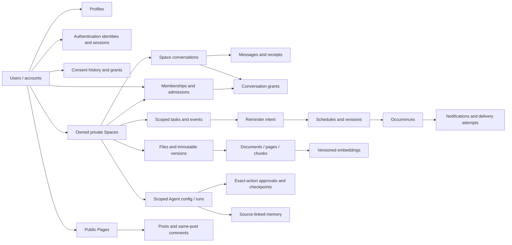

# Chapter 6: Data Model, Integrity and Persistence Contract

Status: DRAFT FOR PRODUCT, DATA AND SECURITY REVIEW. This document proposes a persistence design; it is not an applied schema, executable migration, verified database or production-readiness claim.

Source-of-truth role: the [documentation map](README.md) names this contract as the authority for the intended data model, at level 3 of the [authority hierarchy](PRODUCT_CONSTITUTION.md#article-4-authority-hierarchy). The tables actually built are listed in [DOMAIN.md](DOMAIN.md#modules-and-tables); they are evidence of the implementation, not decisions.

## 1. Scope and Source Authority

This continues the [release plan](CHAPTER_01_RELEASE_PLAN.md), [identity contract](CHAPTER_18_IDENTITY_CONTRACT.md) and [private Space contract](CHAPTER_03_SPACE_CONTRACT.md). It develops the C18-T02 and C3-T02 data handoffs and the C1-T05 foundation for the family-task/reminder milestone.

- [Chapter 6](Chapter6.md) provides principles, example SQL and a document/RAG model. Preserve its examples as source evidence, not ready-to-run migrations. Source titles and table names are indexed below.
- The source ends at section 6.18. It does not contain a complete migration set, retention schedule, recovery plan or final acceptance list. Added constraints, workflows and tests here are explicitly design proposals.
- M1 remains verified accounts, private family membership, ordinary tasks and a one-time in-app reminder. Public community, messaging and controlled Agent capabilities remain full-MVP work; health records, E2E choices, advanced files/RAG and external delivery need their approved milestones.
- Proposed product choices in the earlier drafts remain pending. This document must not resolve partner replacement, old-history access, legal retention, initial authentication providers or external consent merely by choosing a SQL default.
- Original sources and previous planning drafts are unchanged. No database service, dependency installation, migration execution, application code, paid provider or deployment is authorized by this planning step.
- All database and product acceptance scenarios are NOT RUN. Document consistency checks establish traceability only, not referential-integrity, concurrency, access-control, durability or restore evidence.

## 2. Exact Source Principles

All four principle titles from [section 6.2](Chapter6.md#L33) are retained verbatim. They apply to APIs, database operations, derived projections and workers together.

| ID | Source principle |
| --- | --- |
| C6-R01 | Every record must have an owner and scope |
| C6-R02 | Client input is never trusted |
| C6-R03 | PostgreSQL owns durable state |
| C6-R04 | Derived data can be rebuilt |

Foreign keys prove that referenced records exist; they do not prove that the current caller is allowed to read or change them. Application authorization, database constraints, scoped queries and correctly bounded transactions are complementary controls.

## 3. Source Topic Coverage

All 18 numbered topics are retained with their exact titles and anchors. Coverage is not a claim that every source example already satisfies its stated principles.

| ID | Source topic | Source reference |
| --- | --- | --- |
| C6-S01 | Purpose of This Chapter | [6.1](Chapter6.md#L3) |
| C6-S02 | Core Data Principles | [6.2](Chapter6.md#L33) |
| C6-S03 | Logical Data Domains | [6.3](Chapter6.md#L236) |
| C6-S04 | Recommended Technology Architecture | [6.4](Chapter6.md#L311) |
| C6-S05 | Identifier Strategy | [6.5](Chapter6.md#L481) |
| C6-S06 | Common Table Conventions | [6.6](Chapter6.md#L507) |
| C6-S07 | Identity and User Tables | [6.7](Chapter6.md#L550) |
| C6-S08 | Space and Group Data Model | [6.8](Chapter6.md#L633) |
| C6-S09 | Community Page and Post Tables | [6.9](Chapter6.md#L772) |
| C6-S10 | Conversation and Message Data Model | [6.10](Chapter6.md#L864) |
| C6-S11 | Tasks, Events, Reminders, and Notifications | [6.11](Chapter6.md#L1018) |
| C6-S12 | Agent Data Architecture | [6.12](Chapter6.md#L1135) |
| C6-S13 | Agent Approval Model | [6.13](Chapter6.md#L1274) |
| C6-S14 | Agent Checkpoints | [6.14](Chapter6.md#L1323) |
| C6-S15 | Agent Memory Architecture | [6.15](Chapter6.md#L1361) |
| C6-S16 | File and Object Storage Architecture | [6.16](Chapter6.md#L1447) |
| C6-S17 | Document Processing and RAG Data Model | [6.17](Chapter6.md#L1535) |
| C6-S18 | Permission-Aware RAG Retrieval | [6.18](Chapter6.md#L1641) |

## 4. Source SQL Inventory

These are all 27 `CREATE TABLE` relations in the source, in source order. Other required relations appear in its domain list or neighboring chapters without SQL. This inventory does not imply those missing relations can be omitted.

| ID | Source table | Source SQL |
| --- | --- | --- |
| C6-B01 | users | [definition](Chapter6.md#L559) |
| C6-B02 | user_profiles | [definition](Chapter6.md#L587) |
| C6-B03 | user_consents | [definition](Chapter6.md#L606) |
| C6-B04 | spaces | [definition](Chapter6.md#L656) |
| C6-B05 | space_policies | [definition](Chapter6.md#L701) |
| C6-B06 | space_members | [definition](Chapter6.md#L723) |
| C6-B07 | pages | [definition](Chapter6.md#L779) |
| C6-B08 | posts | [definition](Chapter6.md#L812) |
| C6-B09 | comments | [definition](Chapter6.md#L851) |
| C6-B10 | conversations | [definition](Chapter6.md#L882) |
| C6-B11 | conversation_members | [definition](Chapter6.md#L907) |
| C6-B12 | messages | [definition](Chapter6.md#L923) |
| C6-B13 | tasks | [definition](Chapter6.md#L1025) |
| C6-B14 | events | [definition](Chapter6.md#L1049) |
| C6-B15 | reminders | [definition](Chapter6.md#L1072) |
| C6-B16 | notification_deliveries | [definition](Chapter6.md#L1094) |
| C6-B17 | agent_configs | [definition](Chapter6.md#L1162) |
| C6-B18 | agent_runs | [definition](Chapter6.md#L1181) |
| C6-B19 | agent_steps | [definition](Chapter6.md#L1219) |
| C6-B20 | agent_tool_calls | [definition](Chapter6.md#L1243) |
| C6-B21 | agent_approvals | [definition](Chapter6.md#L1281) |
| C6-B22 | memory_items | [definition](Chapter6.md#L1393) |
| C6-B23 | files | [definition](Chapter6.md#L1466) |
| C6-B24 | documents | [definition](Chapter6.md#L1566) |
| C6-B25 | document_pages | [definition](Chapter6.md#L1588) |
| C6-B26 | document_chunks | [definition](Chapter6.md#L1604) |
| C6-B27 | embeddings | [definition](Chapter6.md#L1628) |

## 5. Storage Responsibilities

| Store or component | Authoritative responsibility | Explicit limitation |
| --- | --- | --- |
| PostgreSQL | Accounts, identity bindings, current permissions and consent, business records, schedules/occurrences, approvals, durable work intent, metadata and audit. | It is not a binary media store, a replacement for authorization or proof that an external message arrived. |
| Redis | Bounded cache, approximate presence/typing, rebuildable coordination and transport acceleration where reviewed. | Never the sole record of an accepted reminder, membership, approval or job. Lost Redis state must not grant access or silently lose committed work. |
| Private object storage | Immutable originals, permitted encrypted artifacts, previews, exports and retained derivatives. | Object paths or an issued signed URL do not prove current access. PostgreSQL tracks ownership, version, processing and deletion state. |
| Search, vectors and projections | Rebuildable authorized search representations, feed candidates and aggregates. | Rebuild from currently eligible retained sources, not deleted data. A stale index hit is not authorization and must not enter Agent context. |
| KMS/secret manager or selected identity provider | Reviewed key material, credential/provider secret handling and trusted authentication operations. | No provider secrets or root encryption keys in ordinary application tables, client bundles, prompts or logs. Specific providers remain undecided. |

Recommended implementation direction: one PostgreSQL database for the initial modular backend, SQLAlchemy 2.x plus Alembic, with an explicitly reviewed PostgreSQL driver and connection budgets. The source offers SQLModel and several worker options; these are alternatives, not a requirement to install competing stacks. Redis Streams or a job library still needs a durable PostgreSQL outbox/job-recovery contract. Selected internal gRPC does not require separate databases or microservices.

## 6. Design Decisions and Open Gates

These decisions refine engineering defaults but remain proposals or open questions, not approved production settings.

| ID | Decision | Proposed direction or unresolved choice | Status |
| --- | --- | --- | --- |
| C6-D01 | Database and access stack | Start with one PostgreSQL database, domain-owned repositories, SQLAlchemy 2.x and Alembic; select supported server/driver/extension versions and connection budget before execution. | PROPOSED |
| C6-D02 | Identity naming and IDs | Use `users.id` as the immutable account ID in this schema proposal; Chapter 18's account is the same entity, not a second user table. Prefer UUIDv7 only if the chosen stack supports it reliably, otherwise UUID4. IDs never substitute for ordering or authorization. | PROPOSED |
| C6-D03 | Ownership and resource references | Private Spaces and public Pages keep separate audience paths. Use typed foreign keys and explicit scope shape, not unconstrained `owner_type/owner_id` strings. Choose canonical post/conversation/resource layouts before DDL. | PROPOSED |
| C6-D04 | Membership, owner and capacity enforcement | Use one current membership relationship plus admission history; serialize roster-sensitive writes and enforce owner/type rules on every admission/reactivation/conversion. Product choices on reserved partner slots remain open. | PROPOSED |
| C6-D05 | States, enums and transitions | Reconcile source active defaults, membership/mute states, task/Agent lifecycle and deletion stages; no example default may bypass verification or publication approval. | OPEN |
| C6-D06 | Messaging identity and ordering | Require a non-null validated sender identity and scoped idempotency, allocate per-conversation order transactionally and commit messages with outbox intent. Encryption/Agent access model must be selected first. | PROPOSED |
| C6-D07 | Schedule and occurrence identity | Persist local intent, timezone, schedule revisions and occurrence/delivery identities; define DST, edits, late runs and recipient changes with Chapters 13/20 before dedup keys are frozen. | OPEN |
| C6-D08 | Authorization and database defense | Central service policy and scoped queries are mandatory; evaluate PostgreSQL row-level security as defense in depth with tested connection-context/reset and privileged-worker behavior. Do not claim RLS is implemented or sufficient by itself. | OPEN |
| C6-D09 | Encryption and data classification | Select E2E modes, encryption/key custody, sensitive-field treatment and plaintext Agent handoff explicitly. A BYTEA column or encrypted disk does not establish E2E privacy. | OPEN |
| C6-D10 | Retention, ownership loss and purge | Define per-domain retention, deletion/recovery windows, consent/source-lineage purge, legal holds and backup expiry. FK cascade is not the entire deletion policy. | OPEN |
| C6-D11 | Durable jobs and provider reconciliation | Use business change plus durable outbox/job intent in one PostgreSQL transaction, bounded worker leases and idempotent consumers; select the transport and provider-specific unknown-outcome policy later. | PROPOSED |
| C6-D12 | RAG versions and dimensions | Tie extraction/chunks/embeddings to immutable file and pipeline/model versions. Decide provider, actual vector dimension and index strategy; source `vector(1536)` is an example, not approval. | OPEN |
| C6-D13 | Recovery, locality and replication | Start with one write authority; define measured workload, read-after-write/security consistency, RPO/RTO, backup/key/object restoration and data region before rollout. No implied active-active multi-region guarantee. | OPEN |
| C6-D14 | Schema delivery and migration gates | Deliver foundation and family-task/reminder tables first; expand by released domain with compatible migrations, explicit invariants and tested backfills. Do not create every future table before M1 can work. | PROPOSED |

The detailed model must demonstrate each constraint's enforcement boundary: row check, unique key, foreign key, deferred constraint/trigger where justified, transaction protocol, or current authorization. Saying that the database handles a rule without specifying how is not sufficient.

## 7. Proposed Logical Schema

This is a candidate relational model, not a committed table-per-feature implementation. Source tables are mapped to proposed refinements; additional records come from the identity/Space contracts and neighboring chapters. Fields below are important contract fields, not exhaustive CREATE statements. No duplicated account, membership, schedule or permission store should be created merely because chapters use different names.

### Types and Common Rules

- Use internal UUID primary keys and explicit foreign keys. UUIDv7/ULID ordering is not a commit order, authorization boundary or gap-free message sequence. If choosing PostgreSQL `UUID`, do not insert ULID text without a deliberate reviewed mapping.
- Use `TIMESTAMPTZ` for absolute instants, preserving a separate validated IANA timezone and local calendar intent for recurring schedules. PostgreSQL stores an instant, not the original timezone name. Keep date-only due dates/all-day events as `DATE`; do not convert them into invented midnight deadlines.
- Use non-null positive `version`/revision values where optimistic concurrency applies. Updating `updated_at` and `version` requires actual controlled write logic; DEFAULT values do not update themselves. Do not add mutable timestamps blindly to append-only events or pure join tables.
- Define NOT NULL deliberately. SQL CHECK expressions that evaluate to NULL may pass, and ordinary UNIQUE keys allow multiple NULL values. Scope XOR, state and deduplication rules must handle nullable values explicitly.
- Use bounded text and schema-validated JSONB for optional provider metadata or versioned configurations. Ownership, role, consent, status, recipient, audit identity and query-critical fields are relational, not an unbounded JSON object controlled by clients.
- Use explicit money currency and fixed-precision or integer-minor-unit arithmetic when budgets are introduced; not float. Cost telemetry, token counts, file sizes and attempts have sensible nonnegative/range constraints. Example limits are not production quotas.
- Retain exactly one authority for each field. A copied `space_id`, account ID or owner field used for efficient filtering requires a matching composite FK or a controlled immutable projection, not a second independent truth.

### Entity Families

| ID | Candidate records and key fields | Source SQL covered | Relations and required refinement |
| --- | --- | --- | --- |
| C6-E01 | `users(id,status,security_version,created_at,deleted_at)`; `user_profiles(user_id,display_name,username_original,username_normalized,timezone,locale,visibility,version)` | C6-B01, C6-B02 | `user_profiles.user_id` is PK/FK to one account. Credentials/contact lookup live separately; source `users.status='active'` must not activate an unverified account. Choose one canonical handle location, not competing username columns in users and profiles. |
| C6-E02 | `authentication_identities`, `contact_points`, `password_credentials`, `verification_challenges`, `devices`, `sessions`, `recovery_operations` | No source CREATE statement; identity-domain addition. | Provider/issuer+subject uniqueness; encrypted destination and versioned keyed lookup; purpose/account/destination-bound proof; individually revocable sessions and protected refresh lineage. Pending enrollment references a legitimate attempt, not an arbitrary user ID. Provider-managed credentials are not redundantly copied into local tables. |
| C6-E03 | `user_consents(id,user_id,purpose,channel,scope,policy_version,status,granted_at,revoked_at)`; scoped `access_grants`, `communication_preferences`, `notification_endpoints` | C6-B03 | Preserve consent history and subject/recipient authority, not just a boolean. Explicit typed scope/grantee fields, current destination binding and grant revisions are needed. Preferences and a verified phone are not consent. Do not discard revocation history by updating one profile flag. |
| C6-E04 | `spaces(id,owner_user_id,space_type,status,policy_revision,roster_revision,version)`; `space_policies(space_id,revision,...)` | C6-B04, C6-B05 | Proposed private Space types follow Chapter 3; public/discoverable values in the example remain a conflict, not enabled behavior. One effective policy pointer/version; reviewed current owner must agree with the roster. Decide version-history storage versus a current row plus immutable audit once. |
| C6-E05 | `space_members(space_id,user_id,current_role,status,current_admission_id,version)`; `membership_admissions(id,space_id,user_id,starts_at,ends_at,history_policy_revision)`; scoped role grants/restrictions | C6-B06 | Stable membership relation is unique per Space/account; separate admission epochs preserve rejoin history. Current admission must belong to that exact pair. Notification mute is not lifecycle. Existing ended memberships may remain as provenance but cannot authorize a new assignment or tool call. |
| C6-E06 | `space_invitations`, `join_requests`, `relationships`, `account_blocks`, `account_mutes`, `account_restrictions`, ownership-transfer requests | No source CREATE statement; required admission/identity additions. | Intended immutable account or protected destination binding, allowed role, expiry, token digest and admission state are separate from delivery/open telemetry. Scope-bound request uniqueness and role/owner transfer audits; links, accepted relationships or a phone label never become authority by themselves. |
| C6-E07 | `pages`, `page_members`, `page_follows`; `posts(id,author_user_id,scope_kind,page_id,space_id,personal_owner_id,status,visibility,version)`; `comments`, `post_media`, reactions/reports | C6-B07, C6-B08, C6-B09 | For the proposed scope shape, exactly one page/Space/personal context is populated and agrees with `scope_kind`. Do not combine unrelated scopes as implicit cross-posting. Comments' parent belongs to the same post. Active page ownership and draft-first intentional publication replace unsafe nullable-owner/public-published defaults. |
| C6-E08 | Proposed `actors(id,kind,user_id,agent_id,service_identity_id)` and server-managed Agent/service identity records | Addition supporting heterogeneous sender/audit attribution. | A non-null actor reference avoids nullable-sender dedup ambiguity across messages, jobs and audit. Exactly one typed backing identity and a matching kind; unique backing identity, restricted provisioning and immutable kind. An Agent actor still records its human initiator/delegation. This proposal is not permission to change a human into a service actor. |
| C6-E09 | `conversations(id,space_id,type,encryption_mode,status,next_sequence,version)`; `conversation_members`; participant/admission history and history grants | C6-B10, C6-B11 | Space-bound participant grants reference the eligible Space admission; standalone DM policy is distinct. Conversation history/cursor belongs to that participant context, not a global Space read marker. Types and encryption modes require canonical decisions, not blindly copying the source list. |
| C6-E10 | `messages(id,conversation_id,sender_actor_id,client_message_id,sequence_number,body_or_ciphertext,reply_to_message_id,...)`; `message_receipts`, `message_attachments` | C6-B12 | Unique `(conversation_id,sender_actor_id,client_message_id)` for logical submitted messages and `(conversation_id,sequence_number)` for committed order. Non-null dedup key for retryable commands; same-conversation reply/cursor constraints and authorized same-scope attachments. System/Agent messages also need stable logical identity. |
| C6-E11 | `tasks(id,space_id,personal_owner_id,created_by_actor_id,status,title,due_date,due_at,version)`; task assignment and state history where required | C6-B13 | Explicit personal versus Space scope and field audience; date-only versus instant semantics. Store current assignee with same-Space membership reference, plus current-eligibility checks on assignment. Historical assignee references are not erased just because the person leaves. Completion actor/time/state must agree. |
| C6-E12 | `events(id,scope_kind,owner_user_id,space_id,page_id,starts_at,ends_at,timezone,version)`; participants/RSVPs and separately protected location/notes | C6-B14 | Exactly one approved owning context, time-range validity and event-specific field audience. A public Page event and private organizer workspace may be linked with an explicit relation, not share all records. Participant identity is not Space membership. Shared calendar integration uses reviewed external mappings later. |
| C6-E13 | `reminders` as scoped user intent; `schedules`, `schedule_revisions`, `schedule_recipients`, `schedule_exceptions`, `schedule_occurrences` | C6-B15 | Proposed one authoritative schedule engine; a reminder links to its schedule rather than both independently computing next time. Base local/UTC/timezone intent, revision and stable logical occurrence key are durable. Task/event reference is optional but not an uncontrolled cross-Space link. Recipients are typed, not arbitrary phone strings. |
| C6-E14 | `notifications`, `notification_deliveries`, `delivery_attempts`, acknowledgments, provider webhook inbox and approved escalation steps | C6-B16 | Logical occurrence/recipient/channel delivery is separate from attempts and from in-app history. Unique attempt number per delivery and scoped provider-message identifier where supplied. Sent/delivered/read/user-acknowledged facts are distinct; a delivery row is not medication adherence. |
| C6-E15 | `agent_configs`, `agent_runs`, `agent_steps`, `agent_tool_calls`, `agent_approvals`, `agent_checkpoints`, versioned tools/delegations | C6-B17, C6-B18, C6-B19, C6-B20, C6-B21 | Config/run/conversation/scope consistency; step and tool references belong to the same run. Approvals bind exact action/payload/recipient/tool/policy and expiry; checkpoints use supported LangGraph persistence semantics and durable references. Sensitive inputs/results are bounded, redacted/encrypted and retained only as justified. |
| C6-E16 | `memory_items`, typed `memory_sources`, memory grants/policies and retrieval eligibility version | C6-B22 | Owner/context shape, source provenance, permitted audience, consent, expiry and deletion are explicit. Typed source links replace unchecked `source_type/source_id` where integrity matters. A memory derived from several sources keeps all dependencies and cannot gain a wider audience than authorized sharing permits. |
| C6-E17 | `files`, immutable `file_versions`, `upload_sessions`, scan/processing records, shares and object deletion jobs | C6-B23 | Stable file identity references immutable object/version/checksum; names are display metadata, not storage paths. Owner/Space/conversation and derivatives remain consistent. Signed uploads do not establish trusted bytes or permit replacing a previously approved version. |
| C6-E18 | `documents`, `document_pages`, `document_chunks`, `embeddings`, extraction/index generations and ingestion jobs | C6-B24, C6-B25, C6-B26, C6-B27 | Document processing references a file version and pipeline revision. Page/chunk uniqueness is per immutable extraction generation; chunk page belongs to its document. Embedding configuration/dimension/revision are explicit and non-null for dedup; replacement versions must not silently rewrite old citations. |
| C6-E19 | `outbox_events`, durable jobs, `consumer_inbox`, request-idempotency records, `webhook_events` and protected integration mappings | No source CREATE statement; required source domain/outbox additions. | Stable logical action/event IDs, scoped payload digest, execution state, attempt/budget, lease token/expiry, current authorization references and safe response projection. Raw tokens are not ordinary outbox payloads; external credential references point to approved secret storage. |
| C6-E20 | `audit_events`, `security_events`, export/deletion workflows and stage records, retention/hold records, key references | No source CREATE statement; required security/lifecycle additions. | Durable controlled evidence of actor/subject/scope/action/result and stages. Audit retention is access-controlled and legally scoped, not an excuse for immortal sensitive payloads. Keep pseudonymous references/tombstones only under policy; a foreign-key RESTRICT error must not indefinitely defeat deletion rights. |

The actor registry proposal addresses real nullable-sender and attribution duplication; it is not a universal object table with untyped ownership. If a maintained identity component already provides equivalent stable principals, reuse it instead of adding a competing registry. Domain ownership remains with the corresponding services even if storage starts in one database.

### Core Relationship View

This conceptual diagram shows selected relational dependencies, not cardinalities for every optional record or a replacement for the catalog. Resource authorization still applies on each traversal.

## 8. Integrity Rules and Enforcement

These C6-K rules are proposed testable invariants. A row constraint cannot query arbitrary other rows; time-dependent access is not safely enforced by putting `now()` into a supposedly permanent CHECK or partial-index predicate. Name the transaction/authorization enforcement where a declarative constraint is insufficient.

| ID | Invariant | Database enforcement | Transaction or authorization enforcement |
| --- | --- | --- | --- |
| C6-K01 | Every business row has one valid owning context. | Explicit `scope_kind`, NOT NULL rules, typed FK columns and a row CHECK that counts/context-matches nullable owners. Personal actor and owning context are different fields. | Derive principal/ownership from authenticated intent and enforce audience; a real FK target is not proof the actor may use it. |
| C6-K02 | Heterogeneous actors are valid and attributable. | Non-null actor FK; exactly one valid backing FK with matching kind, unique backing principal and no client-driven kind change. | Service/Agent registration is privileged; verify actual initiator, delegation and acting page identity at execution. |
| C6-K03 | Identifiers and current contact bindings cannot duplicate or merge accidentally. | Normalized handle/provider-subject uniqueness; defined current contact-key uniqueness with key version and null policy; purpose-bound challenge references. | Reviewed normalization, contact recycling/conflict, preregistration protection and proof consumption. Key rotation must preserve lookup conflict detection, not allow duplicates under a new hash key. |
| C6-K04 | Membership epochs belong to the same Space/account and cannot authorize overlapping access by accident. | Stable membership PK/unique pair, composite FK from current admission to that pair, valid start/end, unique current period under chosen state model. Consider a reviewed exclusion constraint for overlapping stored intervals if needed. | Rejoin/restore requires current admission rules. Effective expiry is checked by the server clock even when a row still says active; historical FK existence is not current membership. |
| C6-K05 | Owner and human capacity invariants survive concurrency. | Current-owner FK, uniqueness for the chosen owner-role representation, and a deferred consistency constraint/trigger if duplicated ownership is retained. CHECK alone cannot count other membership rows. | All admission/reactivation/conversion/restore/ownership writers serialize through one resource roster boundary, recheck current state and protect sole ownership. Suspended partner-slot policy remains pending. |
| C6-K06 | Object references stay in the same resource scope. | Where child carries scope, use composite candidate keys/FKs, e.g. task and assignee membership share `space_id`; grants and file contexts bind to their actual parents. Distinguish optional absence from inconsistent half-populated keys. | Current membership, audience/history, field consent and allowed action are checked again. Do not cascade-delete business history when a member leaves. |
| C6-K07 | Hierarchical children/replies cannot point to unrelated parents. | A parent comment reference uses `(post_id,parent_comment_id)` -> comments `(post_id,id)` with the corresponding unique key; replies use `(conversation_id,reply_to_message_id)` -> messages `(conversation_id,id)`. Similar composite checks bind chunk/page/document and run/step. | Parent editing must not create cycles or evade depth/visibility rules; immutable parent choice or cycle-checked transaction, scoped reads and moderation limits. |
| C6-K08 | Row state and concurrency version are internally valid. | Reviewed status domain/CHECK, required timestamps/actors for terminal states, positive version and field-specific bounds; NULL-sensitive conditions handled explicitly. | Allowed state transitions use current permissions plus expected version/compare-and-set; an enum only validates a value, not the transition that produced it. |
| C6-K09 | Logical messages are deduplicated and ordered per conversation. | Non-null typed sender identity and logical client key on retryable submissions; unique `(conversation_id,sender_actor_id,client_message_id)` and `(conversation_id,sequence_number)`; same-conversation receipt references. | Serialize sequence allocation with message/outbox commit; UUID/time is not commit order. Preserve dedup evidence/tombstones for the specified retry window without retaining deleted bodies indefinitely. |
| C6-K10 | Schedule edits cannot create duplicate intended occurrences or revive cancelled work. | Unique durable logical occurrence identity per schedule, explicit schedule revision and recipient/channel delivery keys; positive attempt number, valid ranges and source-scope FKs. | Calendar/DST/exception policy chooses occurrence identity. Do not blindly add revision to the unique key and send the same logical dose/task reminder twice after an edit. Revalidate current revision/cancel/consent at dispatch. |
| C6-K11 | Consent and access grants are scoped, versioned and revocable. | Explicit subject, purpose, scope and channel/reference, immutable or versioned history with ordered effective revisions; defined uniqueness without nullable wildcard ambiguity. | Resolve current authority on sensitive read/use/dispatch, not just grant existence or a cached `granted=true`. A group owner cannot grant another person's personal consent. |
| C6-K12 | Approval, step, tool and run bind to the same authorized action. | Same-run composite references; immutable action revision/payload digest and recipient/tool/policy binding; unique logical tool execution key and controlled execution state. | Only eligible humans approve; recompute approved canonical intent, check current authority and claim execution atomically. No generic approval of new arguments or forbidden MVP action. |
| C6-K13 | File and document versions have stable provenance. | Unique object/version identity; nonnegative size, valid checksum representation, immutable file-version reference, unique extraction generation and page/chunk ordinals; same-document page FK. | Verify actual stored version/content/scan and scoped attachment access before indexing or serving; object-store operations require a durable multi-step process, not assumed SQL atomicity. |
| C6-K14 | Embeddings match their source generation and model configuration. | Unique `(chunk_id,embedding_config_id)` with non-null config and actual dimension/metric/version contract; published vectors non-null and validated. | Missing provider revision is recorded honestly in config/provenance; never silently overwrite embeddings after a model change. Select indexes by compatible configuration/dimension; apply current ACL before model context. |
| C6-K15 | Jobs/outbox retries cannot acquire unbounded or stale execution authority. | Unique logical job/event/consumer keys, bounded attempts, lease token/fencing epoch, expiry and conditional transitions; provider IDs unique only within correct provider account where supplied. | Claim with bounded locking, perform slow external work outside transactions, renew/release with owner token and reject stale completions. A local lease cannot make an external provider honor fencing or provide exactly-once delivery. |
| C6-K16 | Retention and deletion remain referentially coherent. | Explicit per-FK RESTRICT/controlled CASCADE/SET NULL decisions, purge-stage records, protected tombstones and validated derivation links; no broad cascade from an account into all shared content. | Revoke eligibility first, then resumably purge originals/derivatives under lawful retention. Rebuild/restore must reapply deletion/revocation records before private data can be served. |

Identity/contact constraints, owner consistency and actor-registry retention may require small deferred triggers or dedicated mutation procedures after schema review. Avoid broad ORM event hooks as the only enforcement: workers, maintenance scripts and future services must follow the same invariants. Application DB credentials must not bypass the selected guardrails through unrestricted DDL or privileged writes.

## 9. Transaction and Recovery Workflows

These are candidate execution protocols, not tested database behavior. Use explicit transaction boundaries and a consistent lock order; record the chosen isolation level and compare-and-set semantics in the implementation ADR. A practical starting point is READ COMMITTED with short row locks and refreshed authorization after waits; use SERIALIZABLE only where its semantics and bounded whole-transaction retries are understood, not as a magic replacement for policy.

### C6-W01 Register, Verify and Revoke Identity

Normalize and bind a pending registration through the selected maintained auth component. Unique provider/contact/handle constraints arbitrate concurrent claims; duplicate key errors are mapped safely without account enumeration. Atomically check/consume the purpose-bound challenge and establish the authorized identity state. Do not leave an attacker-supplied password attached to a victim who completes a different legitimate verification flow.

Registration activation, security audit and domain outbox intent commit together where owned locally. Remote identity-provider operations have their own durable reconciliation state, not a distributed SQL transaction. Sessions/refresh lineages are protected and individually revocable; current security version/revocation governs protected requests, including realtime and jobs. Never cache raw OTPs or bearer response secrets as ordinary idempotency payloads.

### C6-W02 Create a Space and Owner Policy

Create the Space, owner membership/admission, effective policy, required initial grants and audit/outbox in one transaction. Circular owner/membership consistency must be handled through reviewed deferred constraints or an equivalent guarded representation checked at commit, not a persistent ownerless intermediate row visible to callers. A default active status must not activate an incomplete couple or unverified creator.

Failure at any write rolls back the whole operation. A repeated creation request returns the authorized canonical identity only after request-hash and current access checks; object existence or the idempotency key alone does not prove the retrying actor may see it. No model or provider request executes while the creation transaction holds locks.

### C6-W03 Accept an Invitation and Enforce Capacity

Within one reviewed lock order, serialize the Space roster/policy, invite consumption, recipient membership/admission and necessary current authority. Check intended account/contact version, current inviter capability, restrictions, expiry, proposed role and any approved organizer confirmation. For distinct invitations racing for the last couple slot, both must conflict on the same admission boundary; locking only their separate invite rows is insufficient.

Insert/activate the eligible admission, consume the invite, add only approved conversation/history grants and commit audit/outbox. Constraint conflicts roll back cleanly; an ORM IntegrityError does not permit continuing inside an aborted transaction. Use a reviewed savepoint/upsert strategy only if it preserves exact request semantics. A replay after removal must not recreate old membership, even if an old idempotency record exists.

### C6-W04 Change Authority, Ownership or Membership

Role, policy, owner transfer, leave/removal, suspension and reactivation compare current actor and target versions under the same resource authority protocol. Ownership transfer validates recipient acceptance and eligible current membership. Update owner and grant representation atomically, bump authorization/roster versions where used and write durable audit/revocation intent.

Dependent cleanup can be asynchronous, but new authorization cannot wait for it. Use shared authority locking or a verified transactional version/fencing scheme for protected writes versus revocation; a stale read followed by an unconditional write is insufficient. Current-authority reads/dispatches use the primary or an explicit consistency mechanism, not an arbitrarily lagging replica. Already committed work and data already delivered cannot be retroactively undone.

### C6-W05 Persist an Ordered Message

Recheck sender, conversation and history/write permissions, then serialize sequence allocation and message insertion on the conversation's durable ordering boundary. Commit the message, attachments/receipts required by the command and outbox event before acknowledgment. Do not reserve sequence blocks in independent transactions and assume clients will never miss a later-committed lower sequence.

For a retry, compare logical actor/conversation/client key and request digest, then return the current permitted canonical message or a conflict. A key collision must not silently replace content. Reconnect uses stable conversation sequence and bounded authorized replay; tombstones and cursor-retention limits are explicit. Client sequence, timestamp, random UUID or Redis publish order cannot substitute for authoritative durable ordering.

### C6-W06 Save Task, Event and Reminder Intent

Validate current creator/assignee/recipient scope, object audience, event field privacy and expected revisions. Commit task/event changes with any explicitly requested reminder/schedule revision and outbox work intent. Creating a due date alone does not imply consent to external reminders. Do not add all shared members to a recipient list or leak a private task title through assignment notifications.

For M1, persist an ordinary one-time in-app schedule with confirmed recipient and timezone/instant. Define date-only versus timed behavior before storage. Full recurrence keeps local intent, zone, recurrence rules, exceptions and chosen DST/late-edit policy; medical instructions and health-record access remain outside the MVP Agent contract. A transaction rollback must leave no orphaned notification or half-created schedule.

### C6-W07 Materialize Occurrences and Claim Durable Work

Use an indexed due scan, bound batch size and a durable schedule cursor/revision. Create unique logical occurrences and job/outbox intent and advance the cursor atomically. A crash before commit advances nothing; after commit, the dispatcher or reconciliation sweep finds pending work even if Redis publication was lost. Materialization must not skip an intended occurrence because only the cursor update survived.

Workers claim eligible rows with short locks, for example a reviewed `FOR UPDATE SKIP LOCKED` queue pattern, and set a lease token/expiry before committing. This pattern is for independent job claiming, not a way to skip a locked membership row and infer authorization. Slow provider calls run outside the claim transaction. Stale workers cannot finalize or release a new owner's claim; fencing/version checks protect local state, while duplicate external effects still require provider idempotency or reconciliation.

Clock semantics matter: PostgreSQL `now()` is the transaction-start timestamp. Check expiry against the intended current execution instant after any lock wait using the approved clock strategy, not an old transaction time that admits an already-expired invite or job. Keep locks short and test the boundary explicitly.

### C6-W08 Deliver, Reconcile and Acknowledge

Resolve the current recipient, verified destination, membership, object audience, schedule state, channel consent and preferences at the dispatch boundary. Claim one logical recipient/channel delivery, record an attempt and use the provider's supported idempotency contract if available. A timeout is an unknown outcome, not automatic permission to send again on another channel.

Persist provider acceptance/delivery/read facts separately, authenticate/deduplicate callbacks and reconcile out-of-order events using a reviewed state machine. Scope provider IDs by provider account; empty or missing IDs are not delivery evidence. In-app notification creation and explicit user acknowledgment are local transactional effects with independent deduplication. Revocation committed before dispatch eligibility blocks new dispatch; already accepted provider requests are recorded honestly and cannot be recalled through a database rollback.

### C6-W09 Approve and Resume an Agent Action

Persist the immutable action intent/revision with its run, step, tool/policy versions, target and recipients. Protect sensitive intent, and calculate its digest from a maintained canonical representation of the validated schema; JSON key order, numeric representation or omitted defaults must not accidentally change or bypass the meaning. A hash is not proof of the approver's authority.

Approval records who confirmed which intent under what policy and expiry. Execution atomically claims the action once and rechecks current user/resource/delegation/consent/approval. Commit local domain effects and execution evidence together when possible. External tools use durable intent, stable logical keys and unknown-outcome reconciliation. Checkpoint resume cannot replay a completed send blindly or return a stale private tool result after revocation. Prohibited MVP actions remain prohibited regardless of approval.

### C6-W10 Complete Upload and Publish Document Generations

Create a scoped upload session and immutable object-version destination with an expiry and limit. Verify the stored object/version, actual size/type/checksum and approved scan before publishing eligibility. A reused presigned PUT must not replace the bytes of a version already scanned/indexed; bind to an immutable provider version or promote into a protected immutable location under a durable workflow. ETags are not universally a SHA-256 content hash.

Record extraction generation/pipeline configuration, issue bounded idempotent page jobs and commit each result against that generation. Ordered page numbers are independent of worker completion order. Chunks and embeddings inherit the exact source/version and current eligibility; failed required pages leave an honest partial state. Switch the current successful generation pointer only after required checks. Keep old citation provenance subject to retention/access, and garbage-collect abandoned objects/generations without serving them.

### C6-W11 Export, Revoke Eligibility and Purge

At deletion or scope restriction, immediately revoke applicable retrieval/authorization eligibility, cancel or block dependent new work and record the durable request. Then resumably purge or anonymize the approved originals, derivatives, memory lineage, indexes, caches, tokens and provider links under domain stage checkpoints. Shared resources, legal holds and backup expiry follow explicit decisions; no generic account cascade deletes everybody's shared messages.

Export builds a permission-filtered immutable manifest/archive from an explicit snapshot strategy, with recent-auth checks, bounded jobs and revalidation before release/download. A long export must not copy unauthorized newer data or keep an unrestricted transaction open indefinitely. Partial or held deletion is not complete; expired export archives and abandoned generations need cleanup. Restoring a backup must reapply the deletion/revocation ledger before user traffic or provider dispatch resumes.

### C6-W12 Rebuild Derived Stores and Recover

Rebuild search/vector/feed projections from retained authoritative records and object versions using a bounded snapshot/cursor plus durable change catch-up. Version the generation and switch only after consistency checks; apply deletes/restrictions during catch-up and recheck current ACL at serving time. Redis presence after loss becomes unknown until fresh heartbeats, not reconstructed proof that a user is still online.

At-least-once event processing uses a durable consumer identity/event dedup record when necessary, committed with its projection mutation. Broker acknowledgment occurs after local commit; crash/replay cannot apply a counter or state change twice. Projection rebuilds, counters and cache keys do not become new permission authorities. Disaster recovery requires coherent database, object and key availability plus a documented stop/reconciliation strategy for external effects that may have happened after the restored snapshot.

## 10. Query, Index and Cache Plan

Indexes follow measured authorized queries, not the number of fields in a table. These are candidate index shapes, not applied indexes or performance claims. Review existing PK/unique indexes before adding duplicates, and index necessary referencing FK paths because PostgreSQL does not automatically index every child FK.

| Query | Candidate access path | Required privacy and operational behavior |
| --- | --- | --- |
| Resolve login/contact/handle | Unique provider+issuer+subject, current destination lookup key/version and normalized handle; scoped session token digest/ID. | Generic failure, no raw destination in index names/log labels; key rotation preserves conflict detection. Bound challenge/identity attempts independently of query speed. |
| List a user's Spaces or a Space roster | Membership `(user_id,status,space_id)` and `(space_id,status,user_id)` with cursor policy; source membership indexes are a starting point. | Recheck effective expiry, Space lifecycle and roster visibility; an index on status alone does not grant access or enforce human capacity. |
| Find pending invite/request | Token digest unique; intended recipient/resource/state and expiry lookup; current request uniqueness under the chosen state model. | An expired-but-unmaterialized row may still block a partial unique key; expire/revoke it transactionally before replacement. Never use a volatile `expires_at > now()` index predicate as permanent uniqueness. |
| Read/replay conversation | Unique `(conversation_id,sequence_number)` with a stable bounded keyset; participant/admission lookup by conversation and actor. | Apply history/audience first; deleted messages use defined tombstone/cursor behavior. Avoid indexing or including whole message bodies merely to cover a list query. |
| List tasks and event agenda | Scope/status/due keysets with stable ID tiebreaker; separate date-only and instant queries; time-range indexes selected for actual agenda overlap queries. | Filter assignment and protected event fields, not just Space ID. Use EXPLAIN with representative distributions; status-only scans are not a scalable default. |
| Scan due schedules/occurrences | `(status,scheduled_at_utc,id)` for pending work, plus schedule/revision/occurrence uniqueness and lease-expiry recovery lookup. | Bound batches and fairness by workload/recipient limits; delayed cleanup cannot extend permission. Validate clock, long-lock waits, retries and duplicate logical occurrence policy. |
| Dispatch outbox/jobs | Pending/available-at ordering, claimed lease expiry, logical-event uniqueness and consumer/event dedup key. | Limit retries, queue age and hot-scope monopolization; do not delete the only durable intent before acknowledged/reconciled processing. Archive dedup data according to the supported replay window. |
| Show notifications/delivery history | Recipient/created-at/ID keyset, occurrence/recipient/channel unique logical delivery and delivery/attempt-number history. | Current target permission may redact details after removal; acknowledgment is not derived from push acceptance or presence. Avoid leaking private titles in counts/previews. |
| Inspect active Agent work | Run owner/scope/status/created-at indexes, run/step ordinal uniqueness, approval/action expiry and ready-checkpoint lookup. | Run list/audit visibility differs from full private prompt visibility. Expensive checkpoint/trace fields are not fetched in every list query. |
| Find file versions/pages/chunks | File/version identity, processing state, document generation/page and generation/chunk ordinal unique keys. | Current file/scan/audience/retention filters precede serving or indexing; source and citation versions are immutable. Large text blobs stay out of unrelated covering indexes. |
| Retrieve authorized knowledge | PostgreSQL FTS/trigram as needed plus compatible pgvector index, scoped relational access predicate and bounded ranking. | Validate the actual query plan and recall within the permitted set. Do not query global top-N then rely on the model or a client to filter. An ANN filter returning too few authorized matches needs a bounded authorized fallback, not removal of ACL filtering. |
| Audit, export and cleanup | Actor/scope/time keysets, deletion/export state and stage keys, retention-due/hold lookups and protected archive expiry. | Partition/aggregate only when measured; preserve required dedup/uniqueness/FKs. Export/list routes must not join every private field or hold a transaction open indefinitely. |

Use `(sort_value,id)` or authoritative message sequence cursors with a defined null/order policy, not OFFSET over unbounded changing feeds. Bind cursors to scope/filter/version where necessary and reject tampering; do not expose a global sequence as evidence of private activity. Public-feed and private-message projection keys remain separate.

Start without sharding or a new database per module. Monitor row counts, index size, autovacuum/dead tuples, lock waits, query latency, disk/WAL growth and connection saturation. If partitioning becomes necessary, explicitly re-evaluate unique constraints (often requiring the partition key), FKs, retention operations, hot partitions and migration compatibility. More workers can overload a fixed database connection budget; pool limits must include API, workers, migrations and administrative headroom.

### Redis, Objects and Vector Generations

Redis keys include relevant user/Space/audience/policy versions and bounded TTLs; private data cannot sit under a public key. Critical revocation is checked against durable current authority, not merely a cache TTL. Redis loss degrades presence/caching and transport while durable jobs are recovered from PostgreSQL. Abuse-limit degradation is a reviewed fail-closed or bounded mode, not unlimited requests during an outage.

Object storage keys are generated and private; immutable version identity, size/checksum and classification are recorded in PostgreSQL. A SQL transaction cannot atomically commit arbitrary S3 operations. Use upload/promotion/purge stages and reconciliation for orphaned objects, missing objects and callbacks arriving twice. A short-lived presigned GET is not immediate access revocation; use the approved current-authorized delivery path from the Space contract, or explicitly change the promise after review. Region/bucket/provider access and encryption policies are separate from opaque filenames.

An embedding configuration identifies provider/model, known or unknown revision provenance, dimension, distance metric and normalization contract. Different dimensions/configurations need compatible storage/index generations; do not force new model vectors into the old `vector(1536)` column. Re-embedding uses a shadow generation and controlled activation, with safe rollback while sources remain eligible. Embeddings, extracted text and filenames can be sensitive data; derived does not mean public or exempt from deletion.

## 11. Migration and Data Lifecycle Plan

Alembic manages reviewed revision history; application startup does not run ad hoc `CREATE TABLE` or broad schema repair. Exact revision files will be created only when implementation is authorized and source-policy choices are sufficiently settled. Migration filenames or illustrative SQL here are not evidence of a runnable database.

### Staged Schema Delivery

| Stage | Schema scope | Gate before dependent implementation/release |
| --- | --- | --- |
| Foundation | Chosen identity/provider references, users/profiles/contact proof, sessions, consent, actors where needed, audit/outbox/idempotency and versioned Space/policy/member/admission/invitation records. | Initial auth and invitation policy, owner/capacity/role invariants, approved enum and FK strategy; synthetic PostgreSQL migration/constraint/race tests. |
| Family planning | Ordinary tasks, schedule intent/revisions/recipients/occurrences, durable work, in-app notifications/attempts/acknowledgment and current authorization gates. | One-time timezone and recipient rules, cancellation/execution boundary, restart/retry evidence and the Chapter 1 M1 demo. No Agent timer or health records implied. |
| Private communication and public community | Reviewed conversations/participants/messages/receipts, Pages/social data, media metadata and relevant moderation/report/rights records. | Encryption/history decisions, public/private publication contract, explicit same-scope constraints, reconnect and safety tests. |
| Controlled Agent and selected document capabilities | Approved Agent config/run/tool/approval/checkpoint/memory records and released file/version/extraction/index generations. | Scoped delegation/approval/consent, source lineage, model/extension configuration and failure/retrieval evaluations. Advanced document processing is not automatically M1. |
| Release operations and future expansion | Export/deletion/retention/restore tooling for every released domain; approved recurrence, providers, analytics or partition changes later. | Data rights and security design begin in the foundation and must work before real-user exposure. Future features do not justify deferring mandatory retention or rights controls. |

### Expand, Backfill, Validate, Contract

1. Specify the invariant, affected domain/queries, minimum compatible application versions, expected volume, lock/runtime budget, rollback or roll-forward path and data-recovery plan. Review privacy and deletion effects of copied fields.
2. Expand compatibly: add nullable/backfillable fields or new records without immediately removing the old representation. For new FK/CHECK constraints on existing data, a reviewed NOT VALID then VALIDATE sequence can reduce initial scanning but still requires lock testing. NOT NULL and uniqueness need their own supported validation strategy.
3. Backfill in bounded restartable primary-key batches with checkpoints and rate controls. Do not use OFFSET, an unbounded transaction, live-user provider actions or a new default that silently makes old records public/active. Handle concurrent writes using one authoritative transition strategy, not two permanently competing writers.
4. Detect duplicate, orphaned and cross-scope data before enforcing constraints. Quarantine/report ambiguous records for explicit resolution; never drop unknown user data or choose an arbitrary owner to make validation pass.
5. Add/validate indexes and constraints using the reviewed PostgreSQL version's capabilities. `CREATE INDEX CONCURRENTLY` is outside a normal transaction block and can leave an invalid index after failure; migration tooling must detect and recover without pretending the operation rolled back atomically. Avoid long DDL waits by explicit lock/statement timeout policy.
6. Deploy readers/writers that tolerate both transition states, verify data consistency/authorization, then contract only when older application versions are retired and rollback requirements are addressed. Dropping columns, enum values or cryptographic material is not safely undone by a generic downgrade.

Test migrations from an empty database and representative previous schema snapshots with synthetic data, including interrupted backfill, duplicate data, failed constraint validation and mixed old/new application versions. A migration marked successful by Alembic is not proof of correct data semantics. Never autogenerate and apply a destructive migration without reviewing its SQL and ownership/retention implications.

### Retention, FK Deletes and Encryption Keys

Define a per-entity policy with data class, subject/controller, purpose, minimum/maximum retention, legal hold handling, export scope, deletion trigger, derivative dependencies, backup expiry and evidence of completion. Soft deletion is a visibility/coordination state, not permanent removal or indefinite retention approval.

- Use RESTRICT or explicit orchestration for shared ownership, active memberships, approvals, provider effects and legally retained evidence. CASCADE is appropriate only for truly owned lifecycle-bound children after authorization and retention review. SET NULL must not turn an owned private object into an unowned or publicly queryable record.
- Purge short-lived challenge/secret/delivery material promptly under the approved policy; retain minimal replay-protection and security evidence for a justified window. Deleting an idempotency record too early can let a late retry repeat an effect; retaining sensitive responses forever is not the fix.
- Deleting a source invalidates memory, extraction, embeddings, search and cache eligibility promptly; derived purge has observable stages. A file download/export already delivered cannot be erased remotely. Report retained legal/backup/provider categories rather than claiming universal instant deletion.
- Keep key references, algorithm/version and rotation metadata as needed; key custody belongs to the selected KMS/secret-management design. Rotation requires dual-read/write migration strategy and verified recoverability where lawful. Destroying a key can make data permanently unavailable and requires explicit reviewed authorization, including backup, shared-key and legal-hold implications.

## 12. Security, Reliability and Operations

Database access uses separate least-privilege application, worker, migration and operational identities. No ordinary API role is a superuser or schema owner with unrestricted DDL; privileged access is scoped, audited and limited. PostgreSQL/Redis/object endpoints stay private except explicitly secured application edges, with TLS and managed secrets. No passwords, connection strings, OTPs or production exports are placed in documents, logs or client bundles.

Central resource/action policy remains mandatory. If adopting RLS under C6-D08, test the actual application role, transaction-local trusted principal/scope context and pool reset on success/error/cancel. Table owners, superusers and roles with BYPASSRLS can bypass intended filters; policies must cover reads and writes, workers and exports, with supported FORCE behavior where appropriate. A test that runs only as a privileged migration user does not prove RLS. Never let a caller choose arbitrary session variables or claim that filtered rows eliminate all timing/existence leakage.

Avoid unbounded SQL transactions, idle-in-transaction sessions, holding row locks during LLM/network calls and sharing one mutable SQLAlchemy session across concurrent tasks. Bound statement/lock/connection acquisition time, honor cancellation with rollback, release connections and make whole-transaction retries explicit. Retry serialization/deadlock failures only for bounded, idempotent transaction bodies; external effects are not repeated as part of a blind transaction retry. Define and test one lock ordering across interacting domains.

Observability should cover query/transaction latency, pool waits, deadlocks, constraints/conflicts, slow queries, replication lag, outbox/job age, lease recovery, due-reminder lag, delivery unknown outcomes, deletion/export stages, index generation freshness and storage/backup health. Prefer safe query fingerprints and bounded error codes; parameterized SQL logging, query plans, traces and dumps must not include sensitive bind values or private payloads by default. Audit/debug access and retention are restricted too.

### Recovery Gates

Backups must cover PostgreSQL base backups/WAL for the selected recovery objective, relevant object versions, encryption/key availability, configurations and job/audit/revocation data. A backup file's existence is not a restore drill. Test restoring into an isolated environment, validating constraints and references, finding missing objects/keys and measuring actual loss/time against agreed RPO/RTO.

After restore, keep production traffic and provider dispatch disabled until deletion/revocation history and external-effect reconciliation are applied. Otherwise a rolled-back delivery record may send a second message or a pre-deletion snapshot may expose data again. Object retention and database point-in-time recovery must have a coherent compatibility policy; encryption keys cannot be an untested external assumption.

A read replica may serve appropriate stale-tolerant public queries, not immediate membership/consent/revocation decisions without a verified consistency strategy. Multi-region failover, cross-region data residency and active-active writes are not promised by using UUIDs. Select one write authority initially and design future extraction only after measuring the real bottleneck and legal/operational need.

## 13. Proposed Database Acceptance Evidence

The source has no final acceptance suite. All C6-V scenarios below are proposed evidence families, currently NOT RUN. They connect source topics to enforceable rules and transaction protocols. Exact table-name coverage or passing Markdown checks do not execute any of these tests.

| Check | Source topics | Integrity rules | Workflows | Required evidence |
| --- | --- | --- | --- | --- |
| C6-V01 | C6-S01, C6-S02, C6-S03 | C6-K01, C6-K06 | C6-W02, C6-W04 | Valid owning contexts persist; ownerless, wrong-kind, dual-context and cross-Space references fail at the specified enforcement boundary. A valid FK with an unauthorized actor is still denied. |
| C6-V02 | C6-S05, C6-S06 | C6-K01, C6-K08 | C6-W02, C6-W06 | ID/type/time/version conventions, NULL-sensitive checks, range bounds and date-only semantics work on the chosen PostgreSQL/driver. UUID/time order is not used as a message or authorization sequence. |
| C6-V03 | C6-S07 | C6-K03, C6-K08 | C6-W01 | Concurrent identity/provider/handle/contact claims, challenged account activation, malicious pending preregistration and retry are tested with real constraints and safe non-enumerating results. |
| C6-V04 | C6-S07 | C6-K03, C6-K11 | C6-W01, C6-W04 | Purpose/destination-bound proof single-use, key-rotation conflict detection, recycled contact and consent scope/version handling cannot merge accounts or transfer authority. No low-entropy secret appears in logs/outbox. |
| C6-V05 | C6-S07 | C6-K08, C6-K11, C6-K15 | C6-W01, C6-W04 | Session/refresh revocation and concurrent reuse, delayed requests, primary/replica consistency and failed identity dependencies deny disallowed later operations. Expiry after a lock wait uses the approved current clock. |
| C6-V06 | C6-S08 | C6-K04, C6-K05 | C6-W02 | Inject failure between Space/policy/owner/admission/audit writes: full rollback, one safe idempotent result on retry and no active ownerless record. |
| C6-V07 | C6-S08 | C6-K04, C6-K05, C6-K08 | C6-W03 | Separate concurrent invitations to the last couple slot, solo addition, suspension/reactivation and conversion preserve capacity. Distinct invitation row locks alone are shown insufficient or rejected by the implemented guard. |
| C6-V08 | C6-S08 | C6-K04, C6-K05, C6-K06 | C6-W03, C6-W04 | Invite-revoke/demotion races, owner transfer versus removal, rejoin epochs, restricted-role changes and policy edits obey defined winning order. Old accepted invites never restore removed permissions/history. |
| C6-V09 | C6-S09 | C6-K01, C6-K06, C6-K08 | C6-W04 | Page/Space/personal post context, intentional publication, active owner policy and private projections reject the unsafe source-default cases. Privacy changes affect warmed discovery/feed caches. |
| C6-V10 | C6-S09 | C6-K07 | C6-W04 | Same-post comment parents and media ownership are enforced; cross-post parent, self/cyclic tree updates and unauthorized attachment references fail without partial writes. |
| C6-V11 | C6-S10 | C6-K02, C6-K07, C6-K09 | C6-W05 | Human/Agent/system sender identity is validated; nullable sender/key collisions, conflicting payload reuse, foreign-conversation replies/receipts and unsupported message-body shapes fail. |
| C6-V12 | C6-S10 | C6-K08, C6-K09, C6-K15 | C6-W05, C6-W12 | Concurrent sends, rollback, lost acknowledgment, worker/gateway restart and replay preserve canonical per-conversation order/dedup. A later committed lower sequence cannot be missed behind an advanced cursor. |
| C6-V13 | C6-S10 | C6-K01, C6-K06, C6-K16 | C6-W05, C6-W11 | Selected E2E/server-readable modes and key/retention rules match actual storage and Agent access. Server logs, search and exports cannot claim plaintext access to opaque E2E ciphertext. |
| C6-V14 | C6-S11 | C6-K06, C6-K08 | C6-W06 | Task scope, assignment versus removal, status/completion evidence, date-only due fields and version conflicts behave atomically; historical references do not authorize current assignees. |
| C6-V15 | C6-S11 | C6-K01, C6-K06, C6-K08 | C6-W06 | Event time ranges/timezones, owning context, protected fields and participant references pass reviewed constraints; RSVP does not admit a Space member and event changes reconcile affected work. |
| C6-V16 | C6-S11 | C6-K10, C6-K15 | C6-W06, C6-W07 | Crash before/after occurrence+outbox+cursor commit, repeated materialization and simultaneous workers produce one logical occurrence and recover unsent work without a live LLM. |
| C6-V17 | C6-S11 | C6-K08, C6-K10 | C6-W06, C6-W07 | DST gaps/overlaps, time-zone travel, date exceptions, edits and late execution follow approved policies. A new schedule revision cannot duplicate the same intended reminder or silently change confirmed instructions. |
| C6-V18 | C6-S11 | C6-K10, C6-K11, C6-K15 | C6-W08 | Recipient removal/cancel/consent change before dispatch prevents disallowed delivery; timeout/unknown provider outcome, duplicate/out-of-order webhook and acknowledgment remain distinct without blind resend. |
| C6-V19 | C6-S12 | C6-K02, C6-K06, C6-K07, C6-K08 | C6-W09 | Agent config/run/scope, parent delegation, run/step/tool references and bounded state changes reject cross-run or privilege escalation. Agent records never grant themselves human authority. |
| C6-V20 | C6-S13 | C6-K11, C6-K12 | C6-W09 | Altered payload/recipient/tool/policy, wrong approver, reused/expired approval and revocation races fail; concurrent claims execute only the permitted logical action. Prohibited actions stay prohibited despite approval. |
| C6-V21 | C6-S14 | C6-K08, C6-K12, C6-K15 | C6-W09 | Checkpoint compatibility, crash/resume/cancel and completed/unknown tool outcomes preserve history without duplicate side effects or restored private context after revocation. |
| C6-V22 | C6-S15 | C6-K01, C6-K06, C6-K11, C6-K16 | C6-W09, C6-W11 | User-approved memory scope, source lineage, confidence bounds, expiry/deletion and derived-copy eligibility are enforced before retrieval, including cached/checkpointed summaries. No automatic all-chat permanent memory. |
| C6-V23 | C6-S16 | C6-K06, C6-K13 | C6-W10 | Upload session completion validates actual immutable object/version/type/size/checksum/scan; delayed PUT/callback, wrong-owner object, orphan and missing bytes cannot publish unsafe or replaced content. |
| C6-V24 | C6-S17 | C6-K07, C6-K13, C6-K14 | C6-W10 | Out-of-order/repeated page jobs, partial failure, re-extraction and file replacement preserve unique generations, same-document page/chunk references and correct versioned citations. |
| C6-V25 | C6-S17, C6-S18 | C6-K13, C6-K14 | C6-W10, C6-W12 | Null/changed model version, vector dimension mismatch, duplicate embeddings, new configuration and shadow-index activation are tested against chosen pgvector versions; no silent vector truncation or overwrite. |
| C6-V26 | C6-S02, C6-S18 | C6-K01, C6-K06, C6-K11, C6-K16 | C6-W04, C6-W11, C6-W12 | Real query tests prove authorized retrieval and safe recall/fallback when the allowed set is small, visibility changes mid-flow or source deletion precedes index cleanup. Unauthorized chunks never reach reranking/model context. |
| C6-V27 | C6-S01, C6-S03, C6-S04 | C6-K08, C6-K15 | C6-W07, C6-W08, C6-W12 | Redis loss, publish-before-ack crash, duplicate consumer event, expired lease and stale worker completion recover from durable intent; fences protect local state but do not invent provider exactly-once guarantees. |
| C6-V28 | C6-S04, C6-S06 | C6-K03, C6-K05, C6-K07, C6-K08, C6-K16 | C6-W02, C6-W04, C6-W12 | Empty/upgrade/interrupted-backfill migrations, dirty duplicate/orphan data, invalid concurrent index and mixed-version application behavior are checked with actual PostgreSQL and rollback/roll-forward procedures. |
| C6-V29 | C6-S02, C6-S04 | C6-K01, C6-K06, C6-K11 | C6-W01, C6-W04, C6-W11 | Least-privilege application roles, selected RLS policy/context reset, pool reuse/cancel, SQL injection/mass assignment and safe logs/dumps are tested; privileged test users cannot stand in for real access controls. |
| C6-V30 | C6-S06, C6-S15, C6-S16 | C6-K06, C6-K11, C6-K16 | C6-W11 | Deletion/export crash/resume, ownership transfer/holds, derived eligibility, archive expiry and authorization change before download preserve data rights without leaking others' data or claiming premature completion. |
| C6-V31 | C6-S01, C6-S04, C6-S16 | C6-K10, C6-K13, C6-K15, C6-K16 | C6-W08, C6-W11, C6-W12 | Isolated database/object/key restore measures RPO/RTO, validates references, reapplies deletions/revocations and reconciles external effects before traffic/dispatch. Missing keys/objects block a false recovery success. |
| C6-V32 | C6-S03, C6-S04, C6-S18 | C6-K09, C6-K10, C6-K15 | C6-W05, C6-W07, C6-W10, C6-W12 | Representative bounded load validates query plans, keyset stability, pool/lock/queue budgets, index growth/recall and cancellation. Source targets are not declared achieved from an empty schema or mocked connection. |

Use deterministic synthetic fixtures, controlled test clocks and real supported PostgreSQL/extension versions for concurrency, migrations, isolation and index behavior. SQLite or in-memory repository tests may complement but cannot prove PostgreSQL locking, partial indexes, RLS, vector filtering or FK semantics. Record commands, artifact versions, counts, skips and failures. No container, database, model provider or application test was run for this draft.

## 14. Developer Handoff and Demo Gates

| Ticket | Accountable role | Depends on | Deliverable and evidence |
| --- | --- | --- | --- |
| C6-T01 | Product/data/security leads, Teams A/C/E | Relevant C1, C18 and C3 decisions | Resolve schema-blocking ownership/state/retention/encryption/provider choices for the selected slice; approve the logical model and record pending future-domain gates. |
| C6-T02 | Data/backend architect, Team C | C6-T01 | Choose supported PostgreSQL/driver/Alembic versions, logical ID/scope/actor representation, FK/delete policy, lock order, connection budget and foundational migration/test harness design. No unreviewed schema autogeneration. |
| C6-T03 | Identity persistence engineer, Team C | C6-T02; identity contract | Implement released users/profile/identity/session/consent records and safe operations with C6-V03 through C6-V05 and C6-V29; use maintained auth components and reviewed secret handling. |
| C6-T04 | Space persistence engineer, Team C | C6-T03; Space policy decisions | Implement creation/admission/owner/history constraints and current-authority transaction protocol; real C6-V06 through C6-V08 races, plus scope tests. |
| C6-T05 | Planning/notification engineer, Team C | C6-T04; approved scheduling/delivery rules | Implement M1 task, one-time schedule, durable occurrences/in-app delivery/ack and cancellation/recovery; C6-V14 through C6-V18 as applicable. Recurrence and live channels remain separately gated. |
| C6-T06 | Messaging/community engineers, Team C | C6-T04; selected encryption/publication contracts | Split domain-owned changes for Pages/posts/comments and conversations/messages/receipts with same-scope keys; C6-V09 through C6-V13. No duplicated membership authority. |
| C6-T07 | File/RAG engineer, Teams C/D | C6-T04; selected file/index scope and versions | Implement only released immutable upload/file/document generations and authorization-aware search; C6-V23 through C6-V26. Do not block M1 on advanced OCR or vector features. |
| C6-T08 | Agent persistence engineer, Team D | C6-T04; C6-T05 through C6-T07 for released tools/sources | Implement scoped configs/runs/tools/approvals/checkpoints/memory using supported LangGraph components; C6-V19 through C6-V22. No Agent code silently added to M1. |
| C6-T09 | Privacy/data-rights engineer, Teams C/E | C6-T03, C6-T04; C6-T05 through C6-T08 for released domains | Implement retention/holds and resumable export/deletion with eligibility revocation; C6-V30 and derivative/secret checks. Mandatory rights/privacy before real-user exposure. |
| C6-T10 | Migration/platform engineer, Team C | C6-T02; C6-T03 through C6-T09 for released revisions | Review generated SQL, upgrade/backfill/validate/contract, failure recovery, schema compatibility and connection settings; C6-V28. Stage migrations as each slice is built, not one unsafe final rewrite. |
| C6-T11 | QA/security/SRE leads, Team E | C6-T03 through C6-T10 for released scope | Run actual constraints/races/authorization/retry/restore/load tests with C6-V01 through C6-V32 applicability; disclose untested providers/features and measure recovery. |
| C6-T12 | API/client architecture leads, Teams C/B | C6-T02; C6-T03 through C6-T11 for accepted runtime evidence | Chapter 7 handoff: canonical IDs/states, scoped projections, error/conflict semantics, cursor/order/retry rules and event/schema versions. Planning may proceed now; runnable APIs cannot be certified without evidence. |

These packages are roles and deliverables, not staffed engineers or executed subagents. Split large packages into bounded tickets with source IDs, owner, explicit non-goals, migration/transaction risks, test commands, acceptance, ADR/runbook updates, demo steps and limits. Security/data-rights review is continuous, not postponed until the final QA ticket. No future provider or vector capability is a hidden prerequisite for the M1 family workflow.

First database demonstration, once implementation is authorized: initialize the approved schema in a disposable local test environment -> create and verify synthetic accounts -> atomically create family/owner -> admit intended member -> create task and one-time schedule -> restart worker/transport -> deliver one durable in-app notification -> acknowledge -> revoke/cancel before subsequent execution -> show denied access and no repeated logical effect. Add controlled rollback, duplicate request and concurrent admission cases. This proves only the delivered slice under tested conditions, not the full schema, external delivery, E2E or production readiness.

## 15. Risks, Tradeoffs and Next Chapter

| Decision or mistake | Advantage of the proposed approach | Cost or failure to avoid |
| --- | --- | --- |
| One initial PostgreSQL authority with domain ownership | Strong relational consistency and simpler operations for shared workflows. | Shared capacity and coupling require disciplined repositories, query budgets and later measured extraction; not a justification for one giant service file. |
| Explicit typed scopes, composite keys and constraints | Cross-parent mistakes fail near their source, even outside one API route. | More deliberate schema/transaction design and migration complexity; FKs still cannot replace authorization or encode every policy. |
| Resource-serialized owner/capacity changes | Makes competing invitations and owner operations predictable. | Hot resources need bounded locks, throughput measurement and careful lock order; unbounded provider calls inside locks can stall everyone. |
| Durable outbox plus leases/dedup | Survives worker and Redis interruptions while preserving accepted intent. | At-least-once delivery requires consumer design, retention and external unknown-outcome handling; do not claim global exactly-once effects. |
| Immutable file/extraction/model generations | Stable evidence, citations and controlled rebuild/rollback. | Storage/cleanup cost and cross-store reconciliation; legal deletion can make old citations unavailable and must not be bypassed for reproducibility. |
| Reusing source active/public defaults without review | Superficially fast scaffolding. | Unverified accounts, accidental public content or premature memberships; choose explicit safe initial states instead. |
| Storing permissions, secrets and business truth only in JSON/Redis | Superficially flexible implementation. | Weak constraints, hidden authority changes, lost durable work and sensitive logs; use scoped relational truth and protected limited metadata. |
| Treating a schema check or backup file as readiness | Easy but misleading progress numbers. | Missing race/restore/security evidence; distinguish this document's structural validation from actual PostgreSQL and product tests. |

Next: [Chapter 7](Chapter7.md), where the identity, Space and data drafts become one canonical REST/error/event/WebSocket contract with explicit authorization, pagination, concurrency, retry and recovery semantics. Carry [Chapter 10 operations](Chapter10.md), [Chapter 11 security](Chapter11.md), [Chapter 13 scheduling](Chapter13.md), [Chapter 14 files](Chapter14.md), [Chapter 19 encryption](Chapter19.md) and [Chapter 20 delivery](Chapter20.md) alongside affected operations.

This completes the proposed data-design handoff, not database implementation. The source examples are preserved and mapped, policy decisions remain visible, and all runtime acceptance evidence must be produced in the authorized build phase.