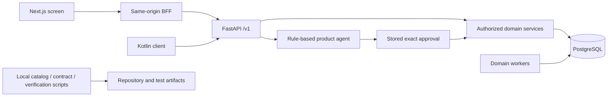
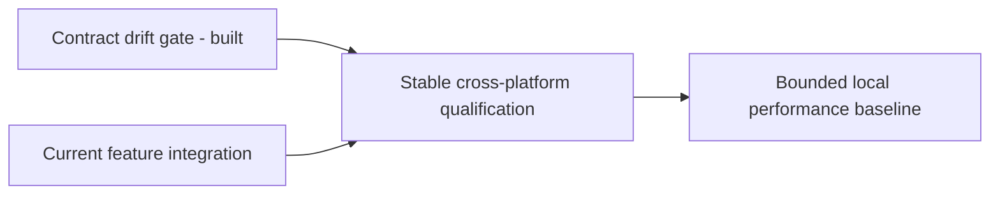

# Repository Intelligence and Engineering System Audit

Date: 2026-10-03. Task: T172, under R12/R13 and DEC-009. Input: the owner's [Production Architecture Audit and Autonomous Engineering System](%23%20Community%20Agent%20App%20%E2%80%94%20Production%20Archi.md), called Part E below.

## 1. Outcome and Scope

**The existing application is not an empty starting point. Its product agent is not a repository-writing engineering orchestrator.** Keep the existing stack, product services and verification tools. Do not install nine agents, run the example engineering SQL, or replace the product agent with the proposed control plane.

This is the initial discovery, reconciliation and execution-plan deliverable requested before broad implementation. It is not approval of the proposed engineering product, a new roadmap, independent security clearance or production readiness. The [Constitution](PRODUCT_CONSTITUTION.md), [documentation map](README.md), [decisions](DECISIONS.md) and existing [tasks](TASKS.md) remain authoritative.

Inspection covered repository inventory, manifests, the application composition root, product-agent routes/models/services/tools, private retrieval, client boundaries, engineering scripts and prior feature evidence. It did not semantically inspect every source file or freshly execute every product workflow. Existing detailed [community](COMMUNITY_AUDIT_2026-10-02.md), [PRD](PRD_AUDIT_2026-10-02.md) and [blueprint](BLUEPRINT_AUDIT_2026-10-03.md) audits are reused with their original dates and limitations.

Only local synthetic checks were run. No product code, database object, dependency, provider, application policy, branch or deployment changed. No existing preview, worker, database or emulator was restarted or reset. The original Part E text, including its incomplete sample code and copied diagram styling, is preserved as input, not installed as executable code.

## 2. Source Identity and Inventory

Base commit: `5c955c48c38e2c88bf6b999a3e733643bc7a60bc`, with **231 uncommitted status entries**. A commit alone cannot reproduce this working tree.

The [before manifest](../.local/verify/engineering-system-20261003/source-before.json) and [after manifest](../.local/verify/engineering-system-20261003/source-after.json) record relative paths, sizes and SHA-256 for **722 non-ignored tracked/untracked files**. Hashes matched across the verification interval, **11:23:49-11:34:05 +05:30**, with no commit change: [comparison](../.local/verify/engineering-system-20261003/source-comparison.json). These fingerprints identify the inspected bytes; they are not an archive of the uncommitted source or a production build attestation.

Generated [inventory](../.local/verify/engineering-system-20261003/inventory.json):

| Surface | Observation | Limit |
| --- | --- | --- |
| Repository files | Backend 211, web 154, Android 188, tests 57, docs 77, scripts 12, packages 10, infra 3, agent 1, VS Code 2, root 7 | Git-visible files, not build outputs, ignored local data or installed packages |
| Feature catalog | 190 groups in 15 domains; every group has exactly one existing ledger row | Coverage of the catalog, not 190 verified workflows |
| HTTP contract | 173 paths, 204 operations, 314 component schemas | Stored artifact; fresh source/artifact comparison passed |
| Database source | 73 literal table declarations in module model files; 39 migration files; one parsed source head, `0040` | Static extraction, not a fresh SQLAlchemy metadata inspection or the running database's migration state |
| Engineering runtime | The top-level agent directory contains only its reserved README | Its mention of LangGraph is not an implementation |
| CI | No Git-visible `.github/workflows` files | No claim about remote branch protection or privately configured CI |

The inventory records operation names, table declaration locations and migration parents. The [earlier metadata/FK map](BLUEPRINT_AUDIT_2026-10-03.md#5-data-and-runtime-inventory) is explicitly a different snapshot at `0037`; its 70 tables and API drift must not be presented as this source state's result.

### Actual Stack and Boundaries

| Component | Repository evidence |
| --- | --- |
| Modular FastAPI API, SQLAlchemy, Alembic, psycopg | [Backend manifest](../backend/pyproject.toml), [composition root](../backend/app/main.py) |
| PostgreSQL 17, local Mailpit, mail/reminder/export/deletion workers | [Compose](../infra/compose.yaml); these are domain workers, not coding-agent workers |
| Next.js 16.2.3, React 19.2.4, TypeScript 5.9.3, TanStack Query, Zod | [Web manifest](../web/package.json); [BFF](../web/src/app/api/%5B...path%5D/route.ts) forwards allowed same-origin requests to `/v1` |
| Kotlin/Compose, Hilt, Retrofit/OkHttp, Room and WorkManager | [Android build](../android/app/build.gradle.kts); production API URL remains an intentionally invalid placeholder |
| Deterministic, model-free product agent | [Agent service](../backend/app/modules/agents/service.py), [parser](../backend/app/modules/agents/parser.py), [tool definitions](../backend/app/modules/agents/tools.py) |
| Private word-based retrieval | [Search service](../backend/app/modules/discovery/service.py), [document models](../backend/app/modules/files/models.py); PostgreSQL full-text search, not embeddings |



There is no source-evidenced arrow from the product agent to Git, a shell, repository writes, an engineering task queue or deployment.

### Critical Paths Traced

1. **Agent task creation:** [agent routes](../backend/app/modules/agents/api.py) -> authenticated, current-admission context -> deterministic parser -> stored proposal -> versioned approval -> existing task service with a stable effect key -> recorded tool result. The [agent tests](../backend/tests/test_agents.py) cover exact approval, stale tasks, cancellation, expiry, isolation and concurrent retries. Those database workflow tests were not rerun here; the current client/BFF tests were.
2. **Private document retrieval:** authenticated account -> active membership and Space -> document admission boundary/task audience -> database-filtered search -> bounded excerpts. Document chunks retain line/offset provenance. [Document tests](../backend/tests/test_documents.py) cover normalization, deletion of derived data, search access and bounds; their existence is not a new execution result.
3. **Engineering verification:** [catalog script](../scripts/feature-catalog.mjs) checks source fingerprints/catalog ownership; [OpenAPI launcher](../scripts/check-openapi.mjs) compares source and stored contracts in a cached, network-disabled, read-only container; [verification runner](../scripts/verify.ps1) records commands, results and source movement. None is a durable engineering scheduler.

## 3. Requirement and Feature Reconciliation

One audit status applies to each row: **implemented** requires current evidence for all named acceptance criteria; **partial** identifies a built subset with known gaps; **broken** requires a reproduced failure; **missing** means no implementation found in the named search scope; **unverified** means insufficient current workflow evidence; **planned** identifies proposed/deferred scope, never approval. Blockers and historical results are separate fields, not extra implementation statuses.

No whole product domain is marked implemented from a successful compile, API count or simulated transport check.

| Requirement | Status | Evidence and remaining qualification |
| --- | --- | --- |
| R1: many Spaces | Unverified | Membership implementation and historical journeys exist in the [Space domain](../backend/app/modules/spaces/README.md); no current live multi-Space journey ran here |
| R2: scoped membership, roles and resources | Partial | Domain access checks and owner/admin/member behavior exist; configurable permissions remain limited (G4); broader isolation needs T169 |
| R3: public communities and private Spaces | Partial | Public Pages and private-content group Spaces exist; member-authored public communities remain C12/Q24 |
| R4: posts, comments, reactions, follows, discovery/search | Partial | Existing community implementation, classification and feed-control tasks T126-T129/T136; no full current live product acceptance run here |
| R5: conversations, tasks, events, documents | Partial | Owning modules and clients exist; historical Part C tests cover newer replies, priorities, calendar and capacity; attachments and broader workflows remain limited |
| R6: family, couple, solo, custom | Unverified | Four types are recorded as built; DEC-017/011 remain provisional and no fresh four-type journey ran |
| R7: scoped agents, tools and approvals | Partial | Seven fixed tools, current-user/current-Space checks and stored approvals; not configurable agent identities/bindings or engineering roles |
| R8: conversation/task/scheduling/notification/memory/retrieval help | Partial | Fixed-command task/reminder/personal-memory assistance; no model conversation or document-answering pipeline |
| R9: deterministic workflows | Unverified | Direct parser/domain-service implementation supports the requirement; this audit does not requalify every timer, retry or state transition |
| R10: ingestion, parsing, chunking, indexing, retrieval | Partial | UTF-8 text/Markdown/CSV up to 512 KB; PostgreSQL chunks/full-text search; other formats, scanning and embedding choices remain gated |
| R11: authorized retrieval | Unverified | Current-membership and item/history filters inspected; adversarial database retrieval tests not rerun here |
| R12: privacy, security, auditability, observability | Partial | Application controls, telemetry and local checks exist; operational, independent review and release evidence remain incomplete |
| R13: mobile, web, backend on existing stack | Partial | Existing stack retained; fresh web type/client and contract gates pass; current full backend/native/release qualification remains T169 |

The complete **190-row catalog coverage snapshot**, including every original backend/web/Android status, ledger line, scope note, domain and contract/requirement reference, is [catalog-ledger.json](../.local/verify/engineering-system-20261003/catalog-ledger.json). Its P/U/N/D statuses are preserved verbatim from [PRODUCT_FEATURES](PRODUCT_FEATURES.md); they are historical ledger entries, not freshly assigned audit statuses. It neither converts deferred features into approved tasks nor conceals stale introductory text.

For Part E's wider domain inventory, identity, community, content, discovery, messaging, private Spaces, governance and notifications map to those existing domain groups and the Part B/C audits. Analytics maps to community/platform work; T132 was in progress at inspection, not a completed owner-insights journey. Operations maps to platform/infra and T169/T168. News, advertising, subscriptions and payments are proposals with Q22/Q23/D5/Q34 gates, not missing approved functionality. Care is retained under DEC-007, not removed because Part E omits it.

## 4. Engineering Platform Capability Matrix

These statuses refer to the proposed **engineering system**, not the similarly named product-agent records.

| Capability | Status | Evidence / gap | Confidence |
| --- | --- | --- | --- |
| Local repository inventory | Partial | Git enumeration, catalog source fingerprints and this audit's hashed manifest; no reusable commit-registered scan service | High |
| AST/symbol/dependency indexing | Missing | No scanner implementation found in scripts, backend or the top-level agent directory; catalog parsing extracts documentation headings, not code ASTs | High |
| API contract inspection | Implemented | T166's source/artifact comparison and all 13 regression tests pass for the bounded OpenAPI gate | High |
| Database/schema discovery | Partial | Alembic, models, static declarations and earlier full metadata report; no reusable engineering schema scanner | High |
| Requirements reconciliation | Partial | Constitution, catalog, tasks and dated audits; no automated acceptance evaluator | High |
| Durable engineering project/task/execution store | Missing | No implementation matches for `engineering_projects`, `engineering_tasks`, `repository_scans`, `task_executions` or `task_dependencies` in the inspected runtime/scripts | High |
| Engineering state machine / DAG scheduler | Missing | Verification runs a selected serial suite list; product-agent status/lease columns do not implement engineering scheduling | High |
| Agent registry / nine engineering roles | Planned | Part E proposal; no deployed role workers or configurable engineering registry found | High |
| Enforced path/tool/network budgets | Missing | No repository-writing executor or its enforcement boundary found; instructions and branches alone would not enforce isolation | High |
| Execution sandbox / isolated worktrees | Missing | Test containers exist; they are not a credential- and resource-restricted arbitrary coding sandbox | High |
| Versioned evidence | Partial | Git, hashes, local summaries/JUnit and documentation checkpoints; no protected immutable evidence custody or retention service | High |
| Review and release authorization | Partial | Written human gates and recorded task reviews; no application-enforced engineering approval/release service | Medium |
| Cross-agent conflict handling | Missing | No reservation/ownership scheduler or automated semantic merge gate found | High |
| Context/retrieval for engineering agents | Missing | Product full-text retrieval is not a code-aware, commit-aware repository index | High |
| Evaluation and failure recovery | Partial | Existing regression suites and source-change detection; no engineering-agent false-completion or interrupted-execution benchmark | High |
| CI/staging/production operations | Planned | No local CI workflow files; external setup and deployment remain prohibited by DEC-005 | High |

Searches covered Git-visible inventory, backend/runtime manifests and source, agent, scripts and infra for the proposed entity/runtime names. A missing status is bounded to these inspected surfaces; no GitHub settings, remote services or hidden local installations were inspected.

## 5. Permissions and Memory Boundaries

### Built Product Tools

The [registry](../backend/app/modules/agents/tools.py) defines three reads and four approval-required writes. Typed API/domain schemas live separately; it is not Part E's generic schema-bearing arbitrary tool executor.

| Tools | Effective scope | Approval |
| --- | --- | --- |
| `family.members.list`, `family.tasks.list` | Current requester, current Space/admission and visible tasks | No mutation approval |
| `agent.memory.read` | Requester's personal opt-in memory | No mutation approval |
| `tasks.create`, `tasks.complete` | Same domain checks as manual task actions; reviewed fields/version | Exact stored approval |
| `reminders.schedule` | Requester's own reminder, current task/time validation | Exact stored approval |
| `agent.memory.save` | Personal approved note/preference, bounded capacity | Exact stored approval |
| Repository writes, shell, external contact, membership changes, payments, deletion through agent | Not supplied as tools; supported refusals are explicit | An approval cannot add a tool or grant authority |

Product memory is account-scoped, not an unrestricted shared engineering memory or automatically per-Space memory (C13). Runs, approvals, tool outcomes and ordered run events are stored in the existing [agent models](../backend/app/modules/agents/models.py). Product approvals do not authorize code changes or releases.

### Proposed Engineering Roles, Not Deployed Permissions

| Role | Minimum intended authority if later approved | Must remain outside that authority |
| --- | --- | --- |
| Architect; Product/Integration | Read scoped code/evidence, propose tasks and architectural records | Approving requirement changes or overriding QA |
| Backend; Frontend/Mobile | Write assigned implementation/test paths in isolated work | Changing contracts, scope or deployment silently |
| AI Infrastructure; Data/Retrieval | Assigned runtime/index code and synthetic evaluation data | Self-granting tools, live private data, provider use |
| Security/Governance; QA/Evaluation | Independent inspection and evidence generation | Self-approval by the implementation identity; hiding failures |
| DevOps/SRE | Approved local operational/test work | Production credentials, spending, deployment or destructive actions |

These are design constraints, not claims that access control currently enforces nine roles. In this audit only repository inspection, generated evidence, bounded local verification and documentation edits were exercised.

## 6. Five Failure Dimensions and Priorities

| Dimension | Observed engineering gap | Existing owner / next evidence |
| --- | --- | --- |
| Data integrity and ownership | Product tables and engineering task concepts must not be conflated. Static schema inventory does not prove migration/lifecycle correctness | DOMAIN/data contract; T169 migration/export/deletion tests; do not execute the sample SQL |
| Context and retrieval | The catalog is not an AST index; old test reports and reserved README wording can be retrieved as if current. Personal memory is not community memory | Evidence timestamps/hashes; C13; proposed P51 |
| Evaluation and regression | Fresh bounded gates pass, but do not cover full backend/native/live/recovery. No engineering false-completion dataset exists | T169 first; P52 only after scope approval |
| Adoption / workflow completion | Screens, endpoints and task counts do not prove complete user or engineering journeys | Existing live/device suites, acceptance records; no invented completion percentage or adoption rate |
| Trust and recoverability | No enforced coding sandbox, authenticated engineering approval or independent review for this audit; release authority remains human | Q37/C17 and existing security/operations contracts; no production claim |

Priority is: preserve requirements and isolation; qualify the current integrated source; measure the bounded local workload; only then consider new engineering infrastructure. No unmeasured latency, cost, availability or false-completion target is adopted.

## 7. Proposal Corrections Before Implementation

1. **Hierarchy:** Part E chapter 3 section 51 puts a task contract above product requirements and architecture decisions. That must not override the confirmed document hierarchy. Recorded as **C17**, still open for any proposed replacement; the existing hierarchy continues to govern.
2. **Sandbox before writes:** Part E's final order introduces the first engineering agents before its security/sandbox phase. Read-only discovery can precede a sandbox; repository-writing execution cannot. Path restrictions, credential/network isolation, resource limits and cancellation must be enforced before the first writing pilot, not bolted on after it.
3. **Keep two systems separate:** Product `agent_runs` and domain task records are not engineering executions/tasks. A new control plane would need its own ownership decision, authorization design and reviewed data lifecycle. No extra FastAPI service, PostgreSQL schema, Redis, Temporal, vector store or object store is necessary merely to perform this initial audit.
4. **Do not migrate the example schema:** It is expressly a logical draft. Before implementation, define project-scoped references, status transitions, acyclic same-project dependencies, concurrency/version checks, idempotent execution and evidence retention. A self-dependency check alone does not validate a DAG.
5. **Completion must be criterion-specific:** Keep implemented, verified, independently reviewed, integrated and released as different facts. A successful test command is not an authenticated release approval. Define the exact distinction between release-ready and authorized-for-release before encoding transitions.
6. **Version the whole input:** Commit SHA plus dirty-tree fingerprints is better than SHA alone, but a reproducible worker also needs preserved source, tool/configuration versions, artifact integrity and isolated dependencies. This audit provides identification, not that entire service.
7. **Avoid duplicate authorities and backlogs:** Part E's build orders extend existing C7/D6, not a confirmed replacement roadmap. The document/evidence owners below are reused. The source's five-factor diagnosis and role separation are useful operating concepts, not approval of every optional product feature.

## 8. Dependency-Aware Next Work

The executable backlog remains [TASKS](TASKS.md). Roles below describe responsibility, not a new assignment to nine services.

| Existing task | Outcome / acceptance | Dependencies and current state | Verification / rollback |
| --- | --- | --- | --- |
| T172, this audit | Trace Part E to current evidence, preserve authority, identify gaps and gates | Complete as an initial audit, not full feature qualification | Hashes, catalog coverage, selected gates, documentation checks; no data migration or product rollback |
| T169, qualification | One stable source passes applicable backend, web type/client/component/live, native JVM/lint/build/device and recovery gates, retaining failures/skips | Already owned/in progress; coordinate current feature integration and T166 rather than start a competing full run | Existing runner and isolated source/emulator practices; do not reset shared services or weaken tests |
| T168, performance | Synthetic workload/environment/source, latency distributions, query plans/counts, locks/pools, live connections and worker ages recorded | Depends on completed T169. Its Ready label is not permission to bypass that dependency; approved SLOs remain Q19/Q28 | Bounded local measurement, no performance tuning without evidence; no product/data change |
| T139, outbox consumers | Reviewed event-consumer contract and applicable audit coverage | Blocked on ADR/U-06; not silently promoted by Part E | Idempotency/duplicate/failure tests after contract approval; no consumer launched here |



**Not executable backlog:** P50-P52 describe the proposed engineering platform. Q37 first decides whether Part E is a working method using current tools, a separate local development tool, or an in-product capability. C17 blocks adopting its replacement hierarchy. This audit does not treat general autonomy as approval to build the control plane.

If a separate local tool is subsequently approved, the recommended pilot is read-only inventory/evidence using existing scripts, followed by a reviewed task/policy contract and tested isolation, then one bounded implementation plus independent QA. A negative permission test, duplicate-execution test, crash/resume test and false-completion test must pass before widening scope. This is a conditional recommendation, not new approved tasks or a selected stack.

## 9. Fresh Verification

The editor test tool reported **no tests found** for the selected Node/Python files. This is a discovery limitation, not a test pass. The repository's existing runner was used instead:

```powershell
powershell -NoProfile -ExecutionPolicy Bypass -File .\scripts\verify.ps1 -Suite records,structure,tokens,contracts,typecheck,client -Output .local\verify\engineering-system-20261003
```

Executed **2026-10-03 11:24:03-11:33:55 +05:30**. [Summary](../.local/verify/engineering-system-20261003/summary.md), [structured results](../.local/verify/engineering-system-20261003/summary.json); source hashes stayed unchanged.

| Gate and runner commands | Exact result | What it proves |
| --- | --- | --- |
| `npm run test:records`; `npm run check:records` | 5/5 and preservation check passed | Record checker behavior and historical record preservation |
| `npm run test:structure`; `npm run check:structure` | 5/5 and catalog/source check passed | Existing catalog ownership and original-source fingerprints, not all Part E requirements |
| `npm run test:tokens`; `npm run check:tokens` | 10/10 and generated-token check passed | Token generation/guarded surfaces, not full accessibility |
| `npm run test:openapi`; `npm run check:openapi` | 13/13 and source/artifact comparison passed | CLI regressions and current API artifact equality; no database workflow qualification |
| `npm --prefix web run typecheck` | Passed, exit 0 | Current web types; earlier 52 missing-key failures are historical and were repaired by T98/T169 |
| `npm --prefix web run test:client` | 222/222, zero failures, cancellations or skips | Simulated client/BFF contract behavior, including five agent-client tests; not live user journeys |

Read-only availability at **11:28:35 +05:30** returned HTTP 200 for the existing web registration page and HTTP 200 `{"status":"ready"}` for the API. Commands: `Invoke-WebRequest -UseBasicParsing -Uri 'http://127.0.0.1:3000/register' -TimeoutSec 30` and the same command for `http://127.0.0.1:8000/health/ready`. [Result](../.local/verify/engineering-system-20261003/availability.json). No login/account creation, viewport test or loaded-source proof follows from those responses.

Not run here: full database/backend workflow tests, web component/live suites, Android JVM/lint/build/device suites, new 320 px/dp or 200% text checks, load/soak, restore/rollback drill, dependency vulnerability scan, model/provider evaluation, independent code/security review, staging or production. No screen changed. Historical checks remain in [EVALUATIONS](EVALUATIONS.md) and their original checkpoints.

## 10. Requested Deliverable Map and Readiness

| Requested deliverable | Result / owner |
| --- | --- |
| Repository architecture report | Sections 2 and 4; maintained [ARCHITECTURE](ARCHITECTURE.md) and DOMAIN remain owners |
| Complete feature implementation matrix | Existing 190-row [ledger](PRODUCT_FEATURES.md) and full [coverage snapshot](../.local/verify/engineering-system-20261003/catalog-ledger.json), plus section 3; not a fresh all-feature certification |
| Prioritized technical gap report | Sections 4, 6 and 7; prior product audits retain detailed gaps |
| Agent/tool permission matrix | Section 5 separates built tools from proposed roles |
| Dependency-aware backlog | Section 8 references existing tasks; proposals remain outside executable work |
| Implementation branches/reviewable changes | Documentation-only working-tree changes; no new branch, commit, PR or product implementation at this approval stage |
| Test/evaluation evidence | Section 9, source manifests and runner reports |
| Security/reliability findings | Architectural limits and review gaps in sections 6-7; not an exploit assessment or independent security review |
| Integration/staging report | Local contract/client checks and availability only; staging not performed or authorized |
| Final production-readiness assessment | **Not production-ready / not release-authorized on this evidence.** T169, performance/recovery/operational evidence and human/provider/release gates remain |

The immediate useful output is a verified repository baseline and an explicit separation between existing product behavior and proposed engineering infrastructure. No completion percentage, release-ready state or nine-agent deployment is inferred from this report.
